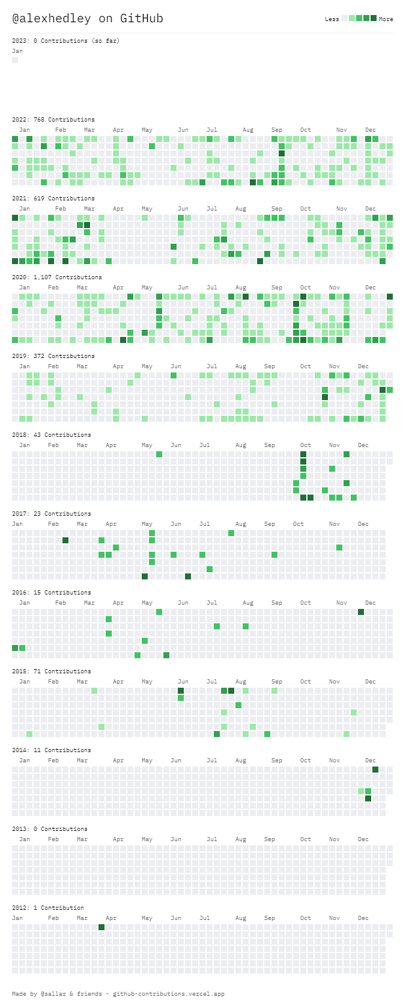
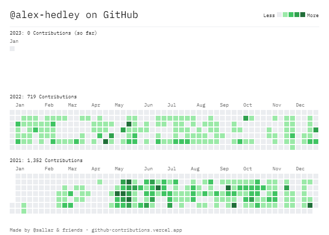

> All your contributions in one image!

- [GitHub Contributions Chart Generator](https://github-contributions.vercel.app/)
- [github-contributions-chart](https://github.com/sallar/github-contributions-chart)

## Alex Hedley

## alex-hedley

## Skyline

Linked with [skyline](https://skyline.github.com/)

- [Backups](https://github.com/AlexHedley/skyline)

### 2022

- [alexhedley](https://skyline.github.com/alexhedley/2022)
- [alex-hedley](https://skyline.github.com/alex-hedley/2022)
