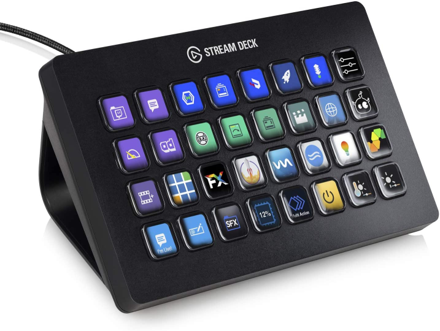

The [Stream Deck](https://www.elgato.com/en/gaming/stream-deck) is an awesome gadget to use whilst streaming. It allows you to configure buttons to perform any number of actions. This could be changing scene whilst streaming, playing some sounds, opening an app, running a set of actions, the list is endless.

Whilst watching [csharpfritz](https://www.twitch.tv/csharpfritz) om twitch I checked the archives and found the following playlist for the [StreamDeck Toolkit](https://www.youtube.com/playlist?list=PLVMqA0_8O85xhVTS3OkTOKhe6IIYj7Tna) where a plugin system written in .NET was built to make it easy to make your own button actions.

With my new love of using [DocFX](/post/DocFX/) I thought I'd help out and contribute to the documentation for the toolkit.

It didn't take long to spin up a site, move some of the existing documentation over and start adding new items, it was merged on stream on 7th June 2020 (adding YouTube link when published)

You can see the [PR !150](https://github.com/FritzAndFriends/StreamDeckToolkit/pull/150)

What's great is there's a workflow with GH Actions to auto build when new content is added.

You can find the [Docs](https://fritzandfriends.github.io/StreamDeckToolkit/articles/intro.html) and start building your own today.

I may add one for [BuildLight](post/BuildLight)
