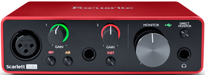
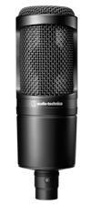
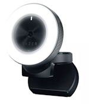
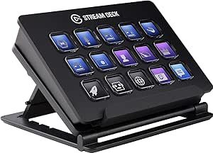

I've finally jumped on the Twitch Streaming bandwagon.

- [alexhedley8](https://www.twitch.tv/alexhedley8)
- [YouTube Archive](https://www.youtube.com/playlist?list=PL_HSdprUDuLykPAunhmNNq7CFoclCsqs-)

I've been watching a few people for the last year including:

- [JamesMontemagno](https://twitch.tv/JamesMontemagno)
- [FrankKrueger](https://twitch.tv/FrankKrueger)
- [BrianLagunas](https://twitch.tv/BrianLagunas)
- [csharpfritz](https://twitch.tv/csharpfritz)
- [dansiegel](https://twitch.tv/dansiegel)

I decided it might be good to start streaming some stuff I work on.

I used to record [videos](https://www.youtube.com/user/599CDTechHelp) for [599CD](http://www.599cd.com/) a few years back when I had more time on my hands but planning them out. Running through the content then recording and sometimes editing. This could take a while. I was always hoping to do it more often so I'd get better at it and it would take less time with more practice.

Setting up the office properly I started putting a list together of equipment I'd need and the purchasing began.

I took advice from a few of the above and started making a [list](https://gist.github.com/AlexHedley/67ae90dcab192a20ef51209242f7928e) and sourcing the equipment.

Not being the best time to get stock during a global pandemic, being everyone was buying webcams etc for their own home setup.

- [Focusrite Scarlett Solo 3rd Gen](https://focusrite.com/en/usb-audio-interface/scarlett/scarlett-solo)
- [Audio Technica AT2020](https://eu.audio-technica.com/AT2020)
- [Razer Kiyo](https://www.razer.com/gaming-broadcaster/razer-kiyo)
- [Stream Deck](https://www.elgato.com/en/gaming/stream-deck)
- Mic arm
- Pop Filter
- peripherals - cables etc

Then I needed some artwork for scenes etc.

I'm no artist so I took some inspiration for other streamers for layout and positioning of elements and then grabbed some logos from my [website](http://alexhedley.com/)

Next up was the software.

- [Obs](https://obsproject.com/)
- [Streamlabs](https://streamlabs.com/)
  - Add the extensions for followers, alerts etc
- [My Stream Timer](http://www.mystreamtimer.com/)
- [Carnac](http://carnackeys.com/)
