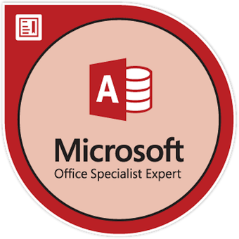

<!-- # Microsoft Access Expert (Office 2019) Certification -->

Today I passed the **Microsoft Access Expert (Office 2019)** _Microsoft Office Specialist (MOS)_ exam 🎉!

I got **953/1000**, with a required score of _700_.

Some of you may know that I have a very fond place in my heart for MS Access. Many moons ago I learned Access at University and found a need to use it in some of my previous jobs, Excel is not a database! Some may ask but why, there are better solutions out there? There may very well be but sometimes there are constraints as to what you are allowed to use so best to use the right solution at the time. I also think it is an under appreciated app. It's been a Low Code / No Code solution long before that even became a term, and it allows for quick development, but you can also create quite complex solutions, you just need to know how to do it. Put the Lego bricks together.

In my journey to learn Access I came across [599CD.com](https://599cd.com/) and the rest, I shall say, is history. I've made a life long friend in Rick, who runs the site, and although I haven't needed to open an Access Database in many many years I still like to keep up to date with what's going on and help out on the forums where I can, give back to a community that helped me when I needed it, early in my career.

You might ask, why then take the exam? I guess there was no real need, but when has that ever stopped me picking up a new hobby or trying something new. I guess curiosity as to what would be involved. How much can I remember? Collecting another [Badge](/blog/tags/certification/) :).

It was a practical exam whereby you are given objectives to perform on an actual database. This can vary between the number of tasks per project and there are a number of projects to work on. I really enjoyed this way to assess someones knowledge as it doesn't just test your theory but how to actually use the knowledge you have.

Normally I would go to a test center but didn't fancy a trip down to London and unfortunately my local test center didn't provide it. The online proctoring worked really well and it's another experience I can tick off the list.

## Info

> Demonstrate that you have the skills needed to get the most out of Access 2019 by earning the Microsoft Office Specialist (MOS) Expert certification.

⏲ You will have 50 minutes to complete this assessment.

## Badge

## 💷 Price

£95.00

-   https://trade.lsbu.ac.uk/product-catalogue/library-and-learning-resources/learning-resource-centre/microsoft-office-specialist-mos-exam-voucher-proctor-fee-non-lsbu-studentalumni

I got access to GMetrix from the above purchase but the following is found here:

GMetrix Tests - Access Expert (Access and Access 2019) Exam MO-500 Practice Tests

$40

-   https://www.gmetrix.com/Products/Details/MOS-Access-2019

## 🔗 Links

-   https://learn.microsoft.com/en-gb/credentials/certifications/mos-access-expert-2019/?practice-assessment-type=certification
