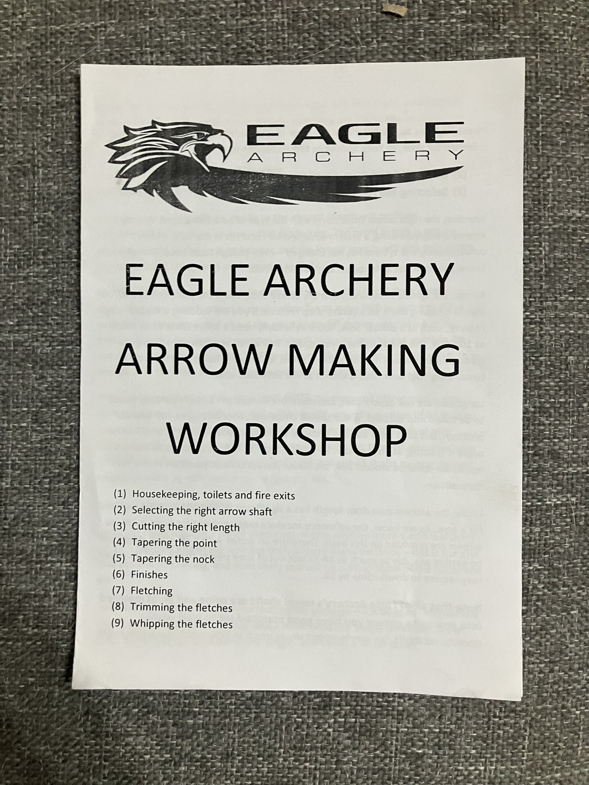
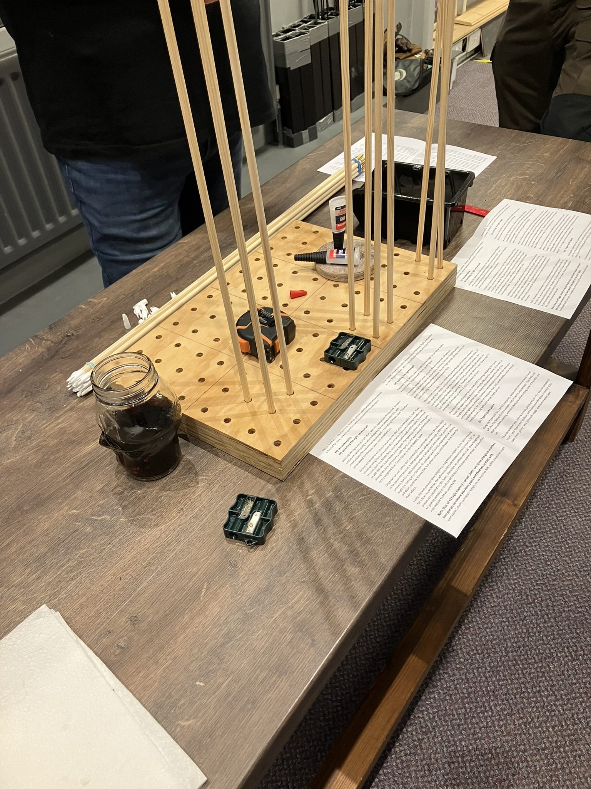
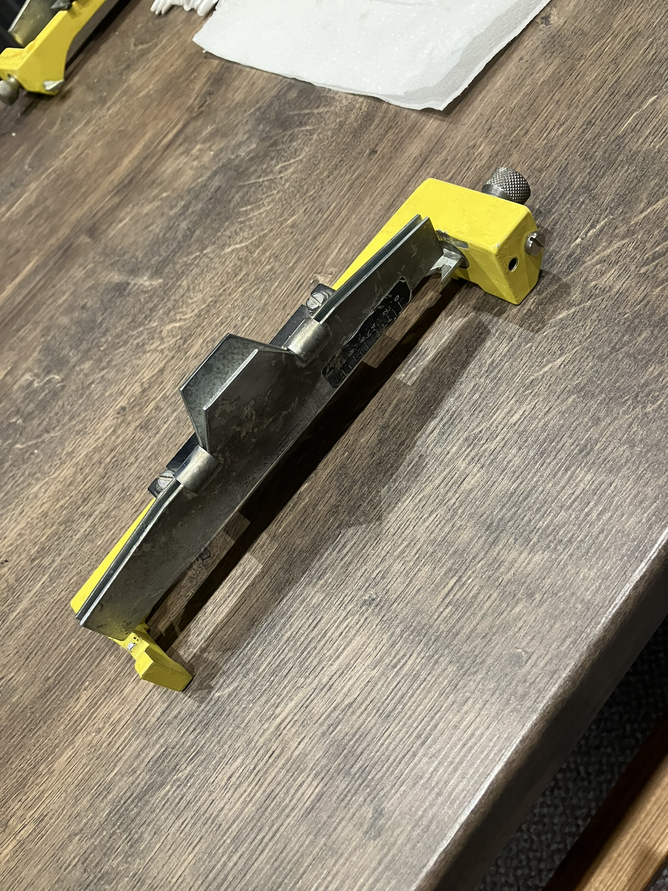
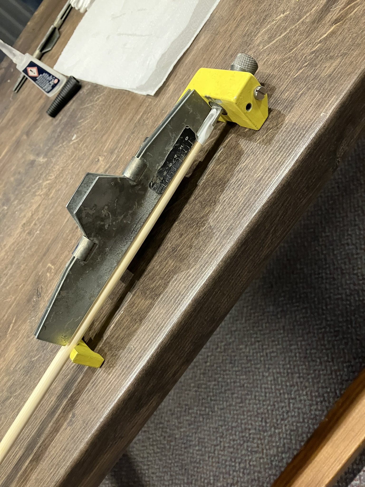
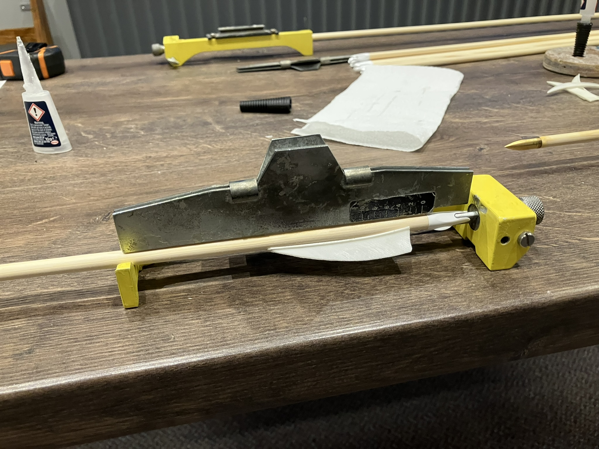
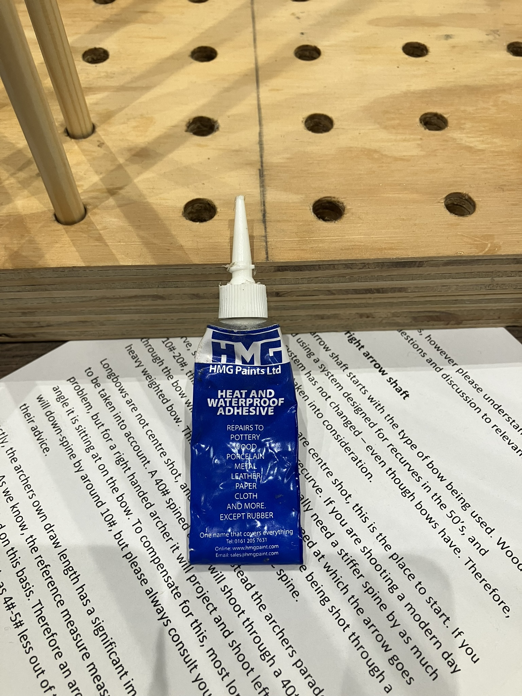
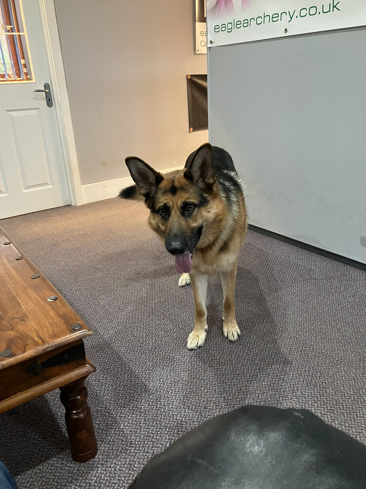

<!-- # Arrow Making Workshop -->

This afternoon I went to Eagle Archery 🦅🏹 to learn how to make my own arrows. It lasted about 2 hours and I thoroughly enjoyed it. I now want to build all the tools needed to make my own!

The real reason I went along was to see the dogs 🐾

## 🔗 Links

- https://eaglearchery.co.uk/products/arrow-making-workshop
- https://eaglearchery.co.uk/products/arrow-making-workshop-1
- https://eaglearchery.co.uk/