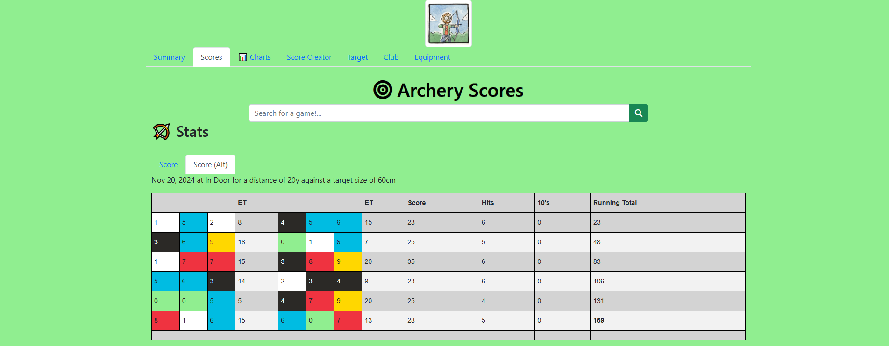

<!-- # Archery Scores Colours -->

I've made an update to my [Archery Scores](https://alexhedley.com/archery/) website. I wanted to easily indicate what scores I got and match the colours to the target.

 Colours")

Should I add some opacity?

Let's see if I can get a full block of gold 🥇 one day!

## 🔗 Links

- https://alexhedley.com/archery/
- https://github.com/AlexHedley/archery

## Related

- [Archery Scores](archery-scores)
- [Returning to Archery](archery-return)
- [Archery Beginners Course](archery)
