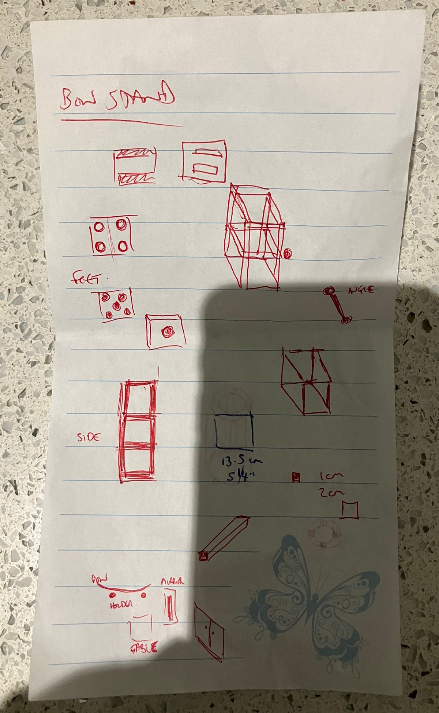
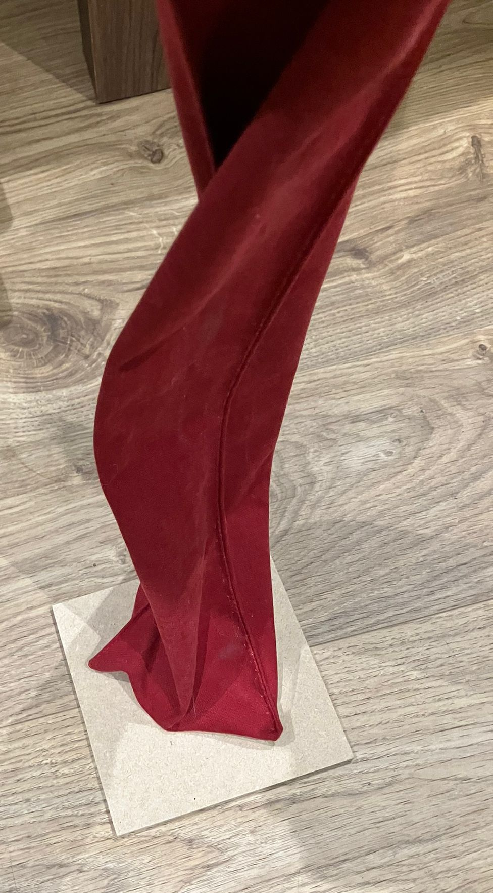
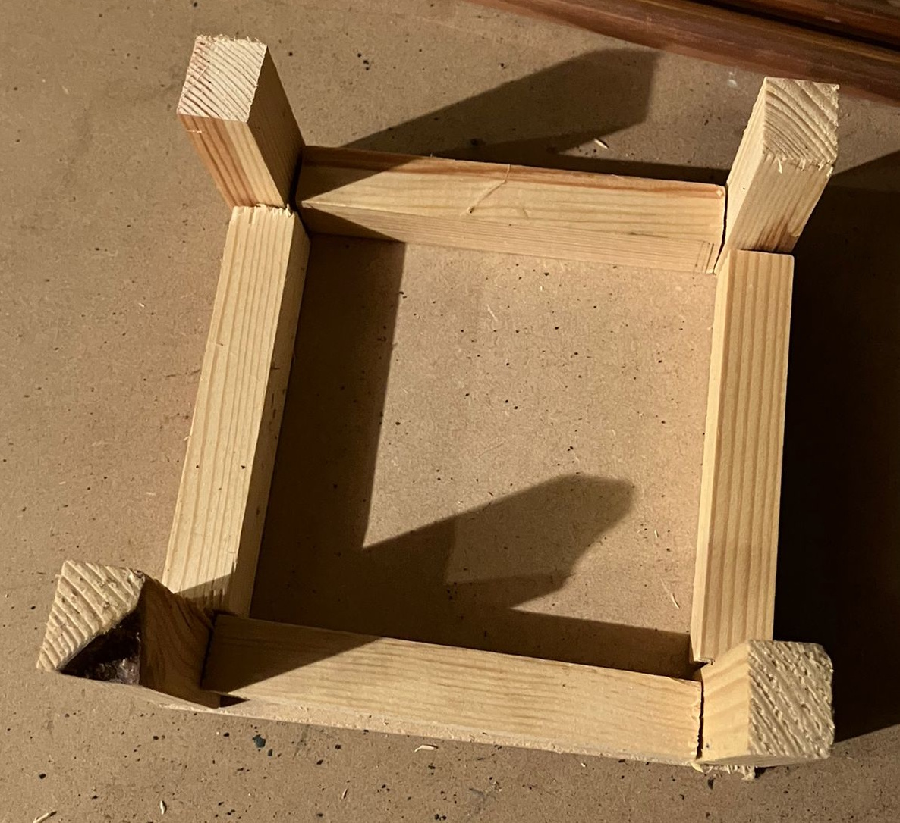
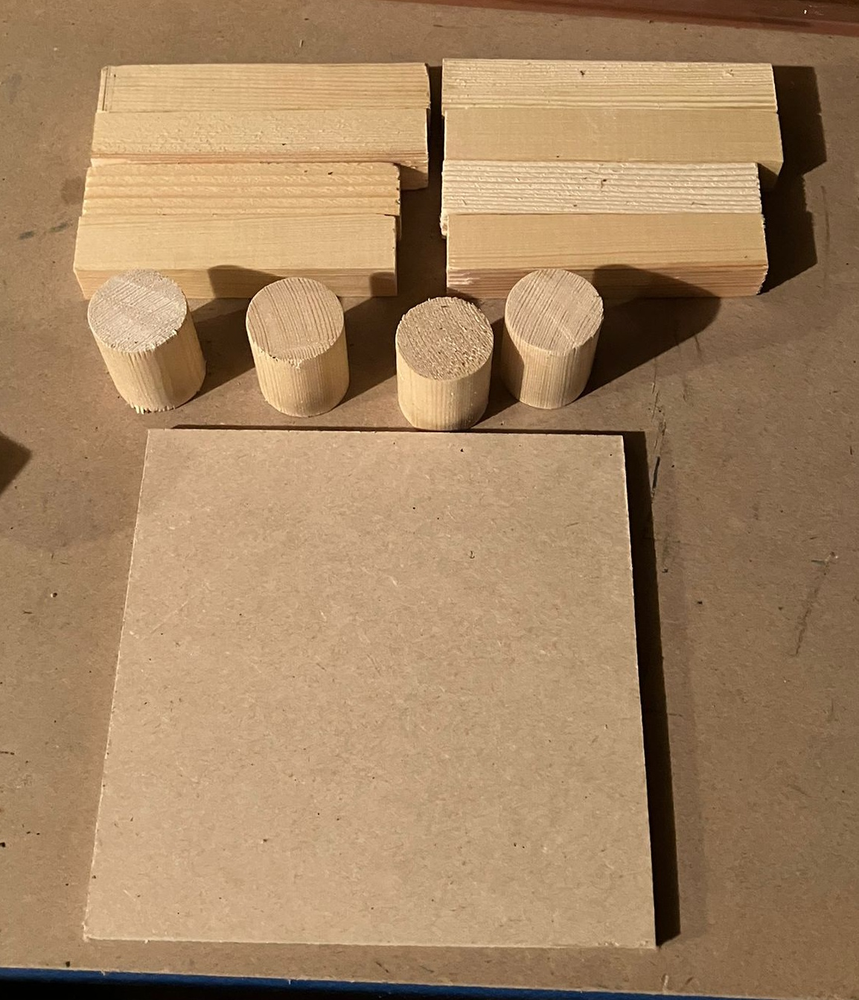
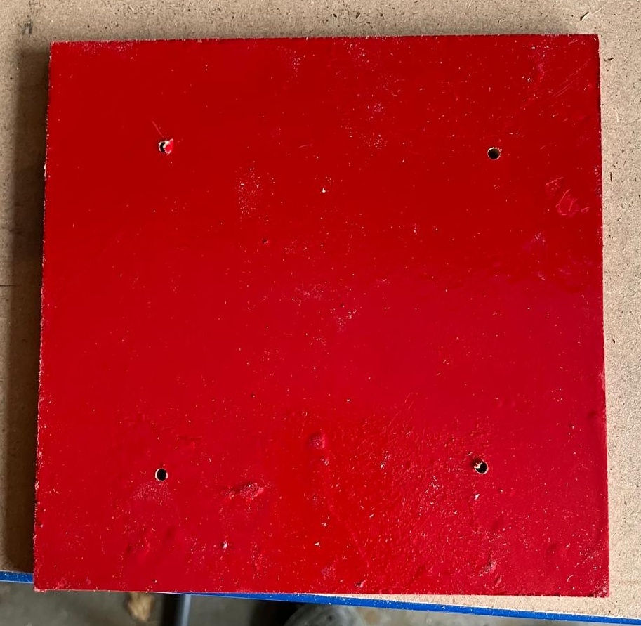
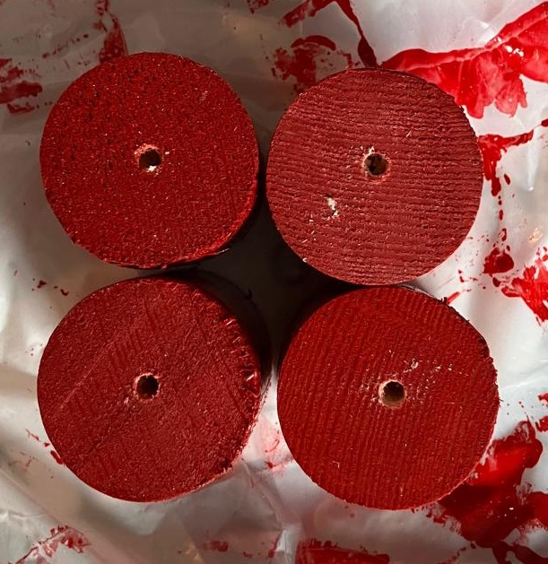
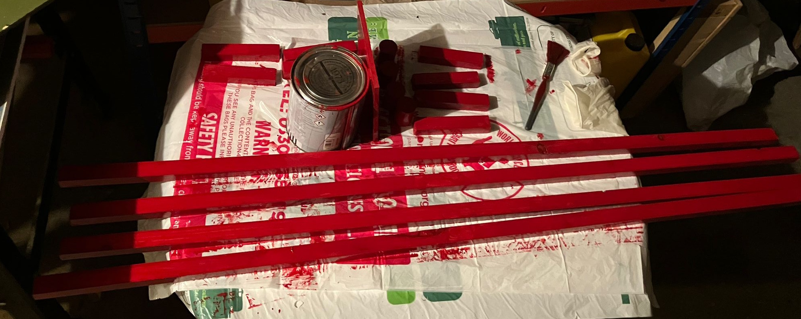
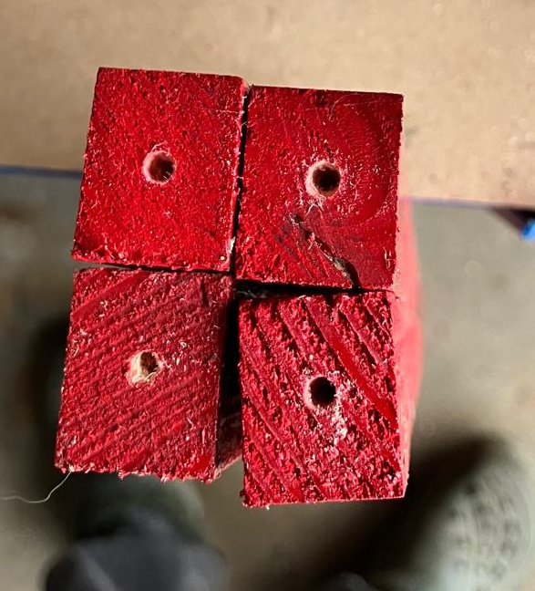
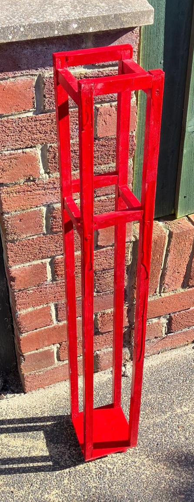

<!-- # Archery Stand -->

Having some spare pieces of wood in the workshop and wanting something to hold my bow in I got to work.

Firstly came up with a simple design:

I cut a small piece of MDF big enough to hold it.

Then worked out a base

I cut the joining pieces and the feet from some left over dowel.

Painted up the base, drilled some holes.

Painted the feet and drilled some pilot holes.

Painted the rest of the pieces.

Drilled some more pilot holes in the main stand pieces.

Put it all together with a few screws, then touched up the paint, and painted over the ends.

## Materials

- Dowel
- Wood
- Screws
- Paint

## Tools

- Saw
- Screwdriver
- Paint brush

## Approx Cost

Couple of quid.
