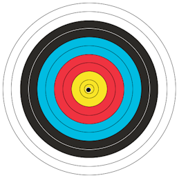
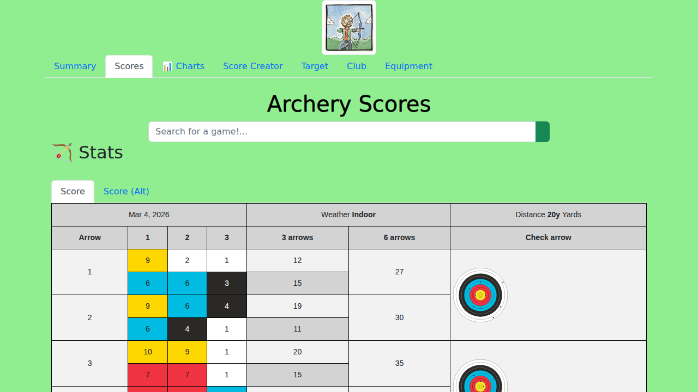

<!-- # Archery Targets -->

When building the [Archery App](archery-scores) I had it in mind to keep track of my shots in an interactive target.

Some people much cleverer than me had already created some on Codepen

- https://codepen.io/GGalizzi/pen/PogggB 
- https://codepen.io/clairecodes/pen/JZqMRy

I wanted two options, one that I could transfer my scratches in the paper scoresheet from the game and plot them onto the interactive target, this could then auto score the games, but I'd also wanted a way of storing that info and the positions to show them on the main scores page.

Taking that as a starting point and using my [GitHub Copilot](github-copilot) trial I got to it:

> Create an interactive target that allows you to select points to show where you hit and their corresponding value is displayed in a table.
> If missed show M.
> Total the sum of scores also.

I've got to review the [MR #6](https://github.com/AlexHedley/archery/pull/6) properly but it's looking good at first glance.

## Site

- 🌍 https://alexhedley.com/archery/

## </> Code

- https://github.com/AlexHedley/archery/

## 🔗Links

- https://github.com/AlexHedley/archery/issues/5
  - https://github.com/AlexHedley/archery/pull/6
  - https://github.com/AlexHedley/archery/tasks/35d338b4-1adb-4086-8da8-66af8e10eced?author=AlexHedley

- https://codepen.io/GGalizzi/pen/PogggB
- https://codepen.io/clairecodes/pen/JZqMRy
