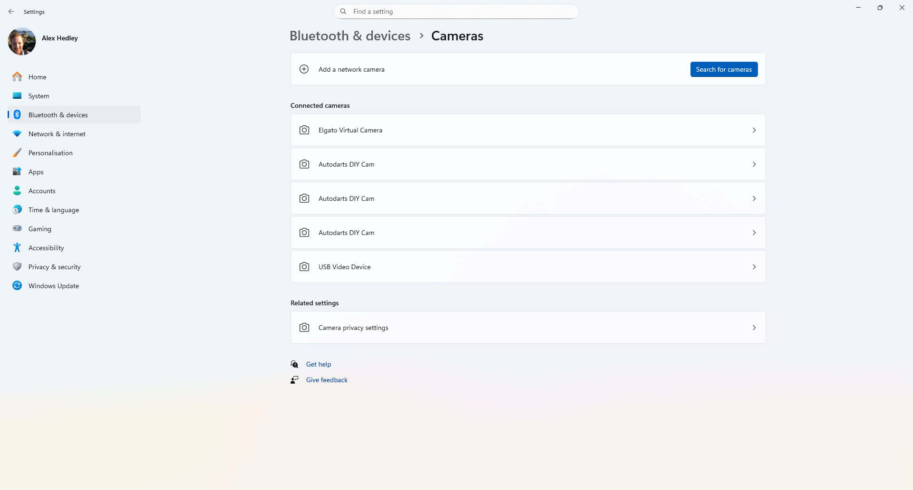
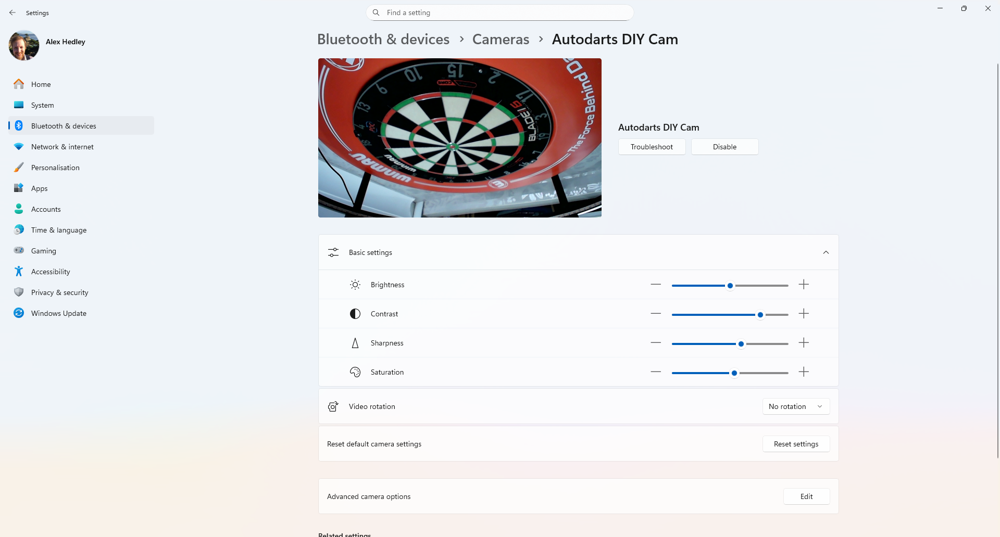
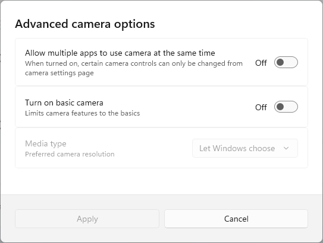
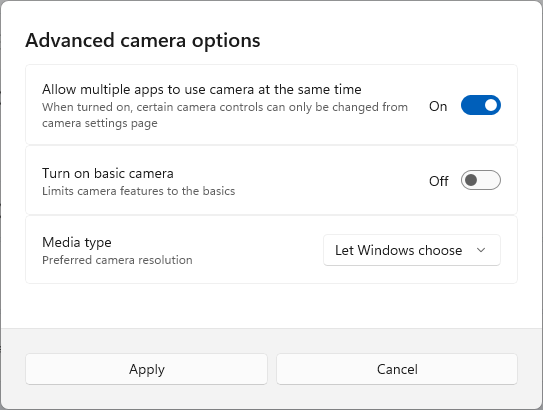
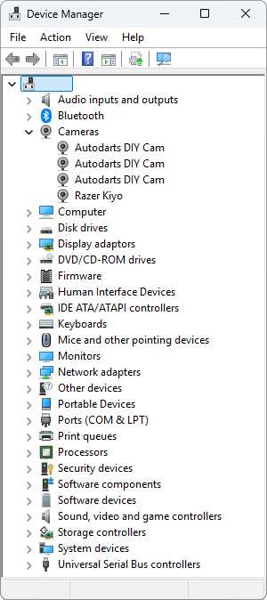
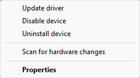
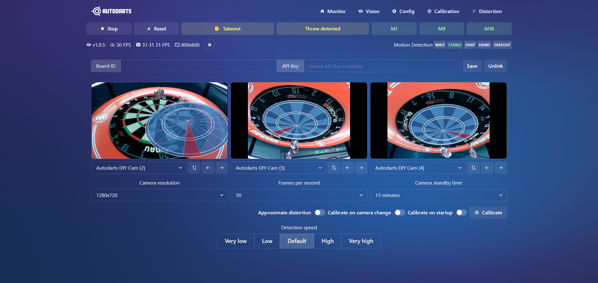

# AutoDarts

Last year I upgraded my [darts](darts) setup but there was one item I was yet to add, this was the auto scoring system.

After some research I decided to get the Dart Eyes from [TeamDarts](https://teamdarts.co.uk/). They offer a selection for different boards and you can also choose for a set of colours to match your setup.

Dart Eyes i1 - Winmau Plasma (Auto Darts Cameras) × 1 Black | £99.99

---

Setting up the camera

⚙️ Settings | Bluetooth & devices | Cameras

Connected cameras

Autodarts DIY Cam (x3)

Select one of them

Click **Edit** on _Advanced camera options_.

Turn on "Allow multiple apps to use the camear at the same time"

You can confirm the camera drivers have been installed correctly and that the **Device Manager** is showing the camera(s) as expected.

Autodarts DIY Cam - Properties

## Auto Darts

Once the cameras are connected to your device you can install the necessary software:

- https://autodarts.com/

Download and install the software.

Instructions

⚙️ Step 1: Install Autodarts & Set Up Your Cameras

1. Visit the official download page: https://autodarts.io/downloads

2. Choose the version for your operating system (Windows, macOS, or Linux).

3. Run the installer and follow the on-screen instructions.

4. During the installation process, you’ll be guided through the camera setup:

    Mount your cameras securely around the dartboard.

    We recommend three cameras positioned at different angles for best accuracy (applicable to Target Corona. Winmau Plasma and Mission Torus already set at 120° apart).

    Connect each camera to your computer or network when prompted.

5. Complete the on-screen calibration steps to ensure accurate dart tracking.

---

🎯 Step 2: Test Your System

Once setup is complete, open Autodarts and throw a few test darts to confirm everything is tracking correctly.

If detection seems off, you can adjust camera positions, lighting, or recalibrate through Settings → Camera Setup.

To access the advanced version of the board manager, open a web browser and type in 'localhost:3180' and click enter. Under the config tab you will then be able to see each camera to make sure they are connected and calibrated properly. 

🎯 You can access the gameplay mode via play.autodarts.io 🎯

You can then run the desktop app or use the browser version to set the **Auto Darts - Calibration**

- http://localhost:3180

I'm currently having an issue getting the third camera to work.

## 🔗 Links

- https://autodarts.com/
- https://teamdarts.co.uk/
- https://www.target-darts.co.uk/omni