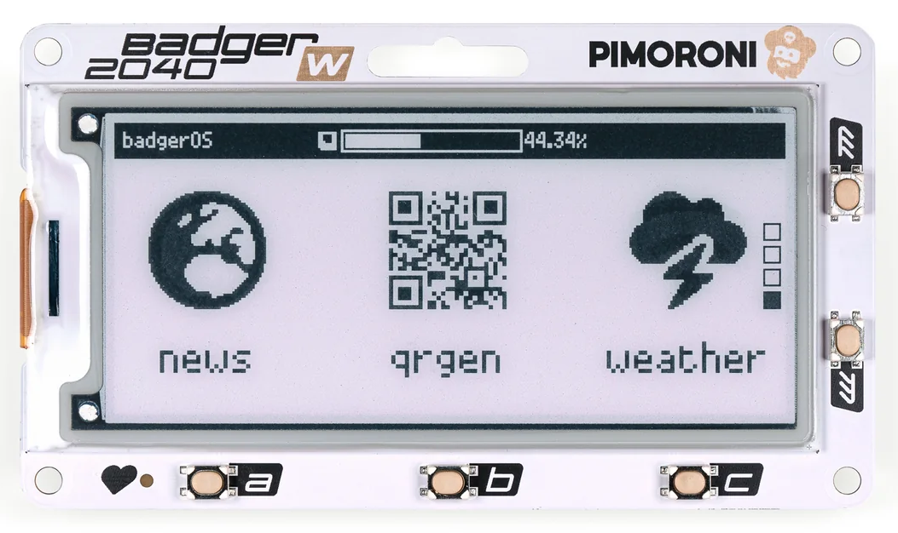
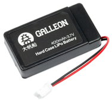

<!-- # Badger 2040 W from Pimoroni -->

After seeing a post about [GitHub Universe 2023](https://githubuniverse.com/) badges I did some research and found a GitHub [discussion](https://github.com/orgs/community/discussions/77583) and a repo [badger2040](https://github.com/badger2040/home) which led me to [Pimoroni](https://pimoroni.com) which of course meant I was buying my own!

Look for an upcoming blog post soon showing how I get on.

## Tutorial

- [Getting Started with Badger 2040](https://learn.pimoroni.com/article/getting-started-with-badger-2040)

## 📼 Videos

How to hack your conference badge - Universe 2022 - GitHub

<?# YouTube ilpC7E69jOU /?>

<!-- <iframe width="560" height="315" src="https://www.youtube.com/embed/ilpC7E69jOU" title="How to hack your conference badge - Universe 2022" frameborder="0" allow="accelerometer; autoplay; clipboard-write; encrypted-media; gyroscope; picture-in-picture; web-share" allowfullscreen></iframe> -->

## Products

|                                             |            |
| ------------------------------------------- | ---------: |
| Badger 2040 W (Pico W Aboard) × 1           |     £32.50 |
| Galleon 400mAh Hard Case LiPo Battery × 1   |      £6.25 |
| LiPo Amigo (LiPo/LiIon Battery Charger) × 1 |         £5 |
| P & P                                       |      £7.99 |
| **Total**                                   | **£62.09** |

")

- https://shop.pimoroni.com/products/badger-2040-w?variant=40514062221395
- https://shop.pimoroni.com/products/galleon-400mah-battery?variant=40061068673107
- https://shop.pimoroni.com/products/lipo-amigo?variant=39779302506579

## 🔗 Links

- 👩🏻‍💻 https://github.com/badger2040/home
- 🗣 [Badge Scanner Hardware and Software used at GitHub Universe 2023](https://github.com/orgs/community/discussions/77583) GitHub community discussions #77583
- 📼 [How to hack your conference badge - Universe 2022](https://www.youtube.com/watch?v=ilpC7E69jOU)
