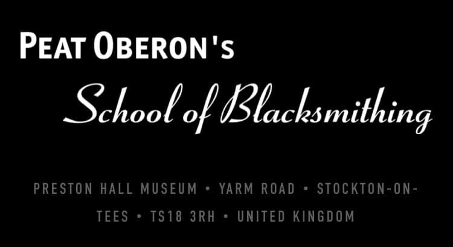
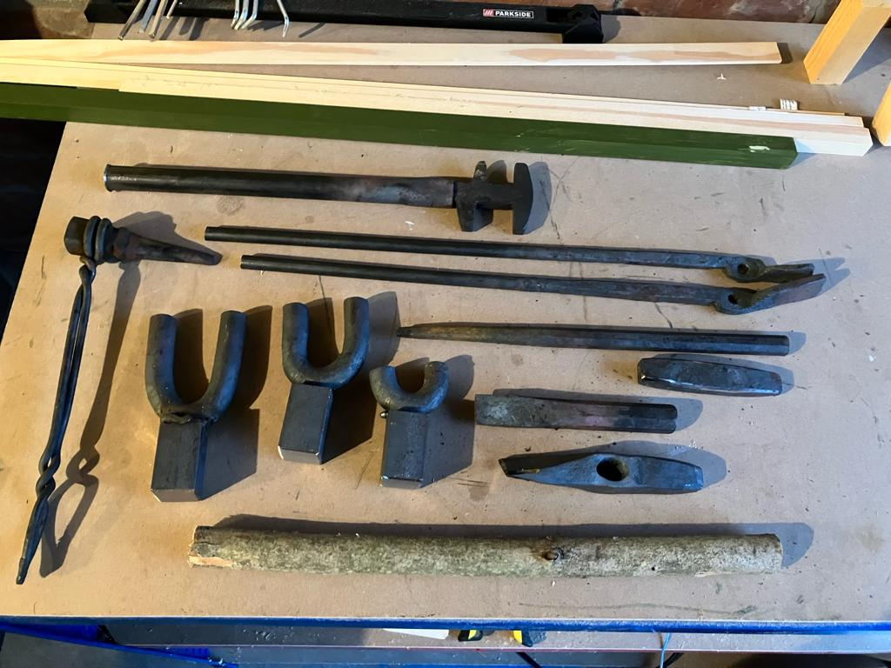

<!-- # Peat Oberon's School of Blacksmithing - Make Your Own Tools -->

<!--  -->

## 📅 Date

- 6th October 2023
- 7th October 2023
- 8th October 2023

## 💷 Price

£390

The cost of the Beginner’s Course is £400 (£390 if paid in full). This includes lunch on each of the three days.

The courses take place from 9.00am to 4.30pm from Friday to Sunday. No previous experience is necessary. Each course can accommodate up to eight people.

This course can also be given as a gift.

## Pictures

<!--  -->

## Outcome

## About

On this tool-making course you will learn how to make a blacksmith's basic tool kit. Over the three days you will make a complete set of the most essential tools needed to get you started and to become self-sufficient. All the tools you make will be yours to keep. Once in possession of this toolkit, you will be able to go on to make more tools for yourself.

Many people who have taken our Beginners Course find that this course is their next natural step. The course is ideal for beginners who are setting up. It is also of great benefit to students of blacksmithing who trained at colleges where they may not have had the opportunity to learn techniques or how to make tools.

---

## 🔗 Links

- https://www.school-of-blacksmithing.co.uk/the-courses#tools-title
