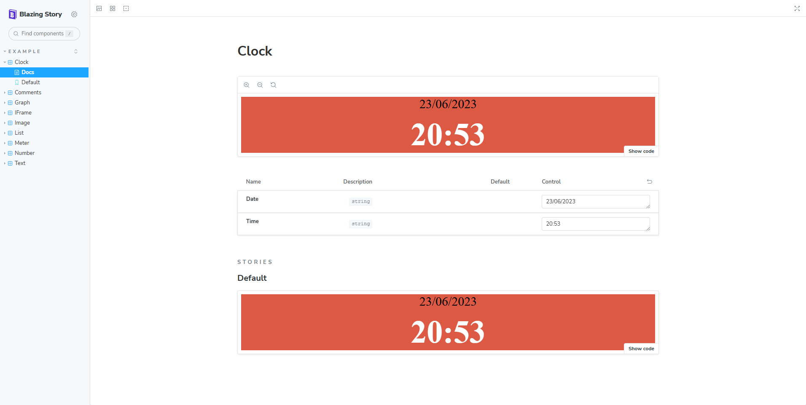

<!-- # Blashing - Blazing Story -->

Having found [Blazing Story](blazingstory) I had to try it out with some of my own Blazor Components. I thought why not use [Blashing](the-beginning-of-blashing).

I followed the thorough steps in their readme and got to creating the required `stories.razor` files. Added the required arguments and ran the app:

There's a few errors thrown when clicking on the different examples which I need to look into but it's just the beginning.

Such a well made project :).

## 🔗 Links

- branch: https://github.com/AlexHedley/blashing/tree/blazingstories
- PR: https://github.com/AlexHedley/blashing/pull/162
- code: https://github.com/AlexHedley/blashing

## Related

- [Blazing Story](blazingstory)
- [The Beginning of Blashing](the-beginning-of-blashing)
