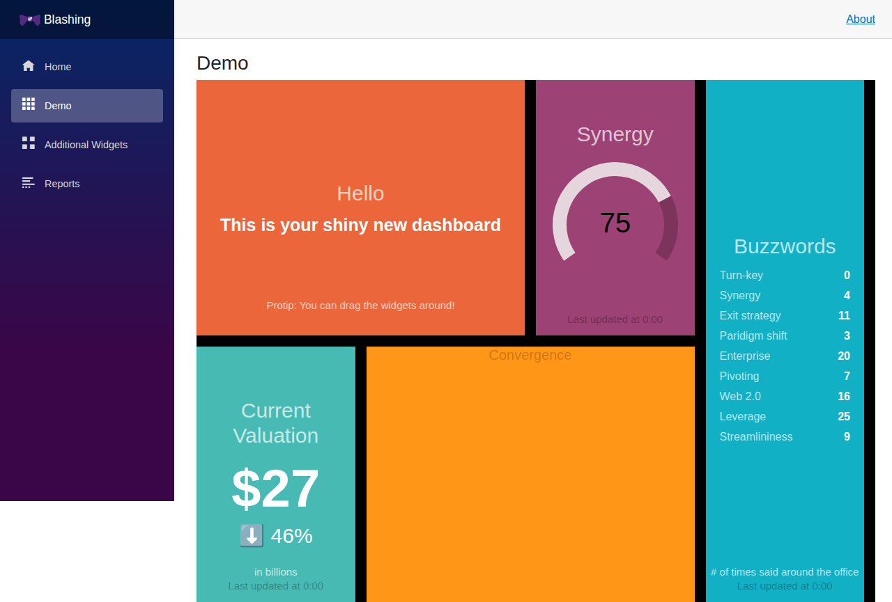
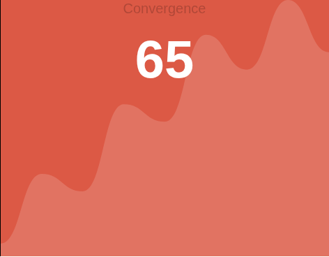
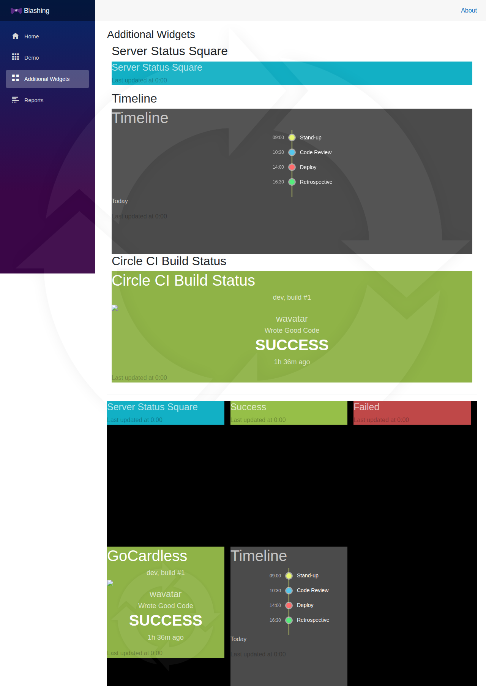
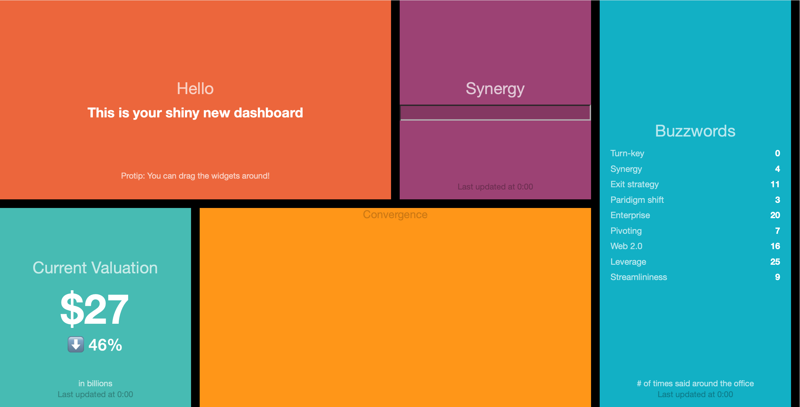
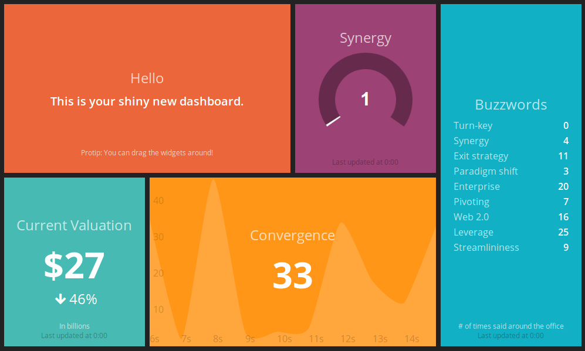

<!-- # Blashing Updates -->

<!--  -->

Continuing on my [GitHub Copilot](github-copilot) journey of raising MRs and not finding time to review them, I thought I'd try some on the Blashing app.

I started with a Review, then tried to complete some outstanding work.

- Review and fixes https://github.com/AlexHedley/blashing/pull/270
- Status Widget param https://github.com/AlexHedley/blashing/pull/271
- Scheduler https://github.com/AlexHedley/blashing/pull/277
- MeterWidget as SVG https://github.com/AlexHedley/blashing/pull/278

- GraphWidget SVG https://github.com/AlexHedley/blashing/pull/279

- Timeline https://github.com/AlexHedley/blashing/pull/281

I might try doing the timeline one manually, like I did with the others and see how it comes out in comparison.

<!--  -->

<!--  -->

## 🌍 Site

- https://alexhedley.com/blashing/

## </> Code

- https://github.com/AlexHedley/blashing

## 🔗 Links

- https://github.com/Shopify/dashing
- https://github.com/Smashing/smashing
