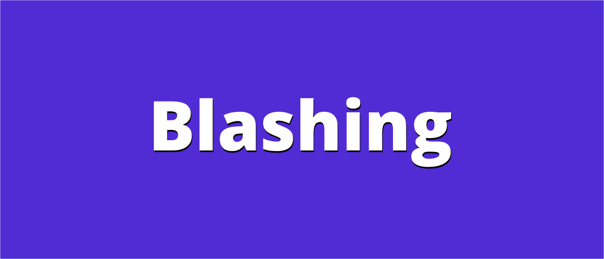
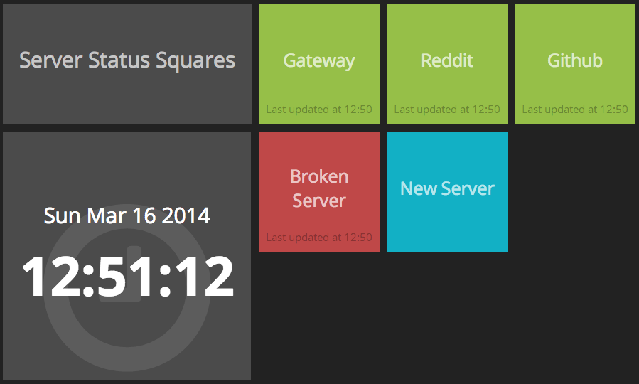
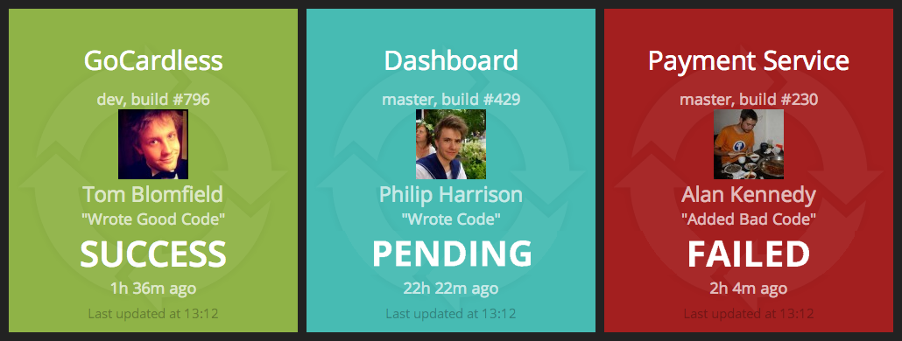
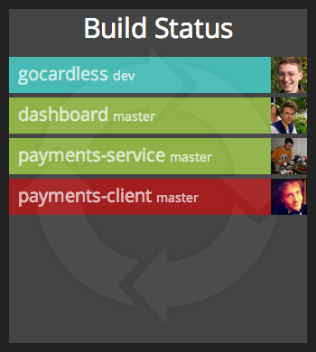

<!-- # Blashing Widgets -->

<!--  -->

What's been happening since the last [Blashing - Blazing Story](blashing-blazingstory) update and the original [Beginning of Blashing](the-beginning-of-blashing), well it was just dependency updates from Dependabot then in June 2025 I updated it to .NET 9. A few months later in 
Oct I moved a majority of the work into a Shared Project [#211](https://github.com/AlexHedley/blashing/pull/211) so I could re-use it in either a Client or Server app. Saves a lot of duplication.

One fantastic thing about [Dashing](https://github.com/Shopify/dashing) / [Smashing](https://github.com/Smashing/smashing) is the Widget system. I started a **Discussion** [#213](https://github.com/AlexHedley/blashing/discussions/213) and from the list I decided on a few I wanted to work on 

## Widgets

- Server Status Widget
- Circle CI Build Status
- Circle CI (List)

### Server Status Widget

- https://github.com/AlexHedley/blashing/issues/214
- https://github.com/AlexHedley/blashing/pull/216

### Circle CI Build Status

- https://github.com/AlexHedley/blashing/issues/215

### Circle CI (List)

- https://github.com/AlexHedley/blashing/issues/219

### Other

Then in Nov 2025 I updated **Blashing** to .NET 10.

Lots more work to get them into a stable state, but it's a good start, and the most likely I'd want to use.

## Site

- 🌍 https://alexhedley.com/blashing/additional-widgets

## </> Code

- https://github.com/AlexHedley/blashing

## 🔗Links

- https://github.com/AlexHedley/blashing
- https://alexhedley.com/blashing/additional-widgets
- https://smashing.github.io/#widgets
- https://github.com/Smashing/smashing/wiki/Additional-Widgets
