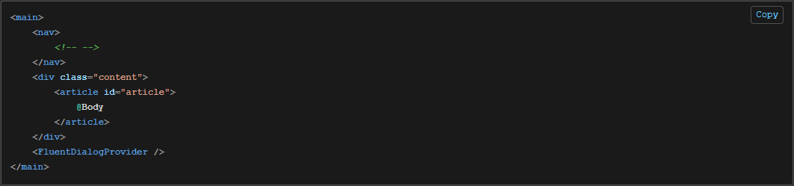

<!-- # Blazor - FluentUI - Code Snippet -->

I've been working with [Blazor](https://dotnet.microsoft.com/en-us/apps/aspnet/web-apps/blazor) for a number of years, you can see [Utility Blazor](utility-blazor) and [.NET Blazor Interactive](dotnet-blazor-interactive) etc for examples.

When the [FluentUI Blazor](https://www.fluentui-blazor.net/) was released I started upgrading a few of the sites to use the new theme/components but hadn't spent much time as the originally functionality was working so wanted to spend my time adding new features, not refactoring existing.

Recently I've started a brand new [project](https://alexhedley.com/projects/) and thought I'd make it from scratch. One piece of functionality I wanted was displaying code snippets with syntax hightlighting functionality. Previously I've used [SyntaxHighlighter](https://github.com/syntaxhighlighter/syntaxhighlighter) from [@Alex Gorbatchev](https://github.com/alexgorbatchev) but there are many others, one being [Highlight.js](https://highlightjs.org/) ([GitHub Code](https://github.com/highlightjs/highlight.js)).

A [Discussion](https://github.com/microsoft/fluentui-blazor/discussions) was raised on their [GitHub repo](https://github.com/microsoft/fluentui-blazor/) page:

> Does this library has any component to display code snippet? #3043
> https://github.com/microsoft/fluentui-blazor/discussions/3043

Firstly you need to copy a number of the files to your project.

- [CodeSnippet.razor](https://github.com/microsoft/fluentui-blazor/blob/dev/examples/Demo/Shared/Components/CodeSnippet.razor)
- [CodeSnippet.razor.cs](https://github.com/microsoft/fluentui-blazor/blob/dev/examples/Demo/Shared/Components/CodeSnippet.razor.cs)
- [CodeSnippet.razor.css](https://github.com/microsoft/fluentui-blazor/blob/dev/examples/Demo/Shared/Components/CodeSnippet.razor.css)
- [CodeSnippet.razor.js](https://github.com/microsoft/fluentui-blazor/blob/dev/examples/Demo/Shared/Components/CodeSnippet.razor.js)

I have another project for _Components_.

You also need some custom js for the app, this needs to go into your 📂 `wwwroot/js/`.

- [highlight-extensions.js](examples/Demo/Shared/wwwroot/js/highlight-extensions.js)

In your `index.html` add a reference to the `js`. Makes sure to update the `[PROJECT_NAME]` to the relevant value you have.

```html
    <!-- highlight -->
    <script type="text/javascript" src="_content/[PROJECT_NAME]/js/highlight-extensions.js"></script>
```

For example they have the following in [_Layout.cshtml #L39](https://github.com/microsoft/fluentui-blazor/blob/main/examples/Demo/Server/Pages/_Layout.cshtml#L39) or
[index.html #L59](https://github.com/microsoft/fluentui-blazor/blob/main/examples/Demo/Client/wwwroot/index.html#L59) depending on whether it's a _Server_ or _Client_ app.

```html
    <!-- highlight -->
    <script type="text/javascript" src="_content/FluentUI.Demo.Shared/js/highlight-extensions.js"></script>
```

The next thing to update is the reference to the `.js` file in the `.cs` code file. Find your [CodeSnippet.razor.cs #L35](https://github.com/microsoft/fluentui-blazor/blob/main/examples/Demo/Shared/Components/CodeSnippet.razor.cs#L35). Update `FluentUI.Demo.Shared/Components/` to the path where you have stored yours.

```cs
            _jsModule = await JSRuntime.InvokeAsync<IJSObjectReference>("import",
                "./_content/FluentUI.Demo.Shared/Components/CodeSnippet.razor.js");
```

Next you just need to use the component!

Add the `CodeSnippet` tag with the `Language` you need. You can find a list of [Supported Languages](https://highlightjs.readthedocs.io/en/latest/supported-languages.html) on their [docs](https://highlightjs.readthedocs.io/en/latest/) site.

```html
<CodeSnippet Language="razor">
@(@"
...
")
</CodeSnippet>
```

Example:

```html
<CodeSnippet Language="razor">
    @(
@"<main>
    <nav>
        <!-- -->
    </nav>
    <div class=""content"">
        <article id=""article"">
            @Body
        </article>
    </div>
    <FluentDialogProvider />
</main>"
    )
</CodeSnippet>
```

Then you will have some beautiful code with a **copy** button too.



You can even use their `StaticAssetsService` to pull in `.txt` file versions of the code.

Thanks to _@vnbaaij_, _@dvoituron_ and others for help with my noob questions.

## 🔗 Links

- https://dotnet.microsoft.com/en-us/apps/aspnet/web-apps/blazor
- https://learn.microsoft.com/en-us/aspnet/core/blazor/?view=aspnetcore-9.0
- https://github.com/dotnet/aspnetcore
  - https://github.com/dotnet/blazor
- https://github.com/microsoft/fluentui-blazor
- https://learn.microsoft.com/en-us/fluent-ui/web-components/integrations/blazor
- https://learn.microsoft.com/en-us/shows/open-at-microsoft/exploring-the-fluent-ui-blazor-components
- https://www.fluentui-blazor.net/
- https://www.nuget.org/profiles/fluentui-blazor
- https://github.com/microsoft/fluentui-blazor/discussions/3043