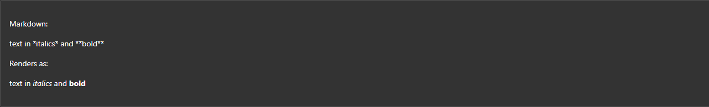

<!-- # Blazor - FluentUI - Markdown -->

Want to display [markdown](https://daringfireball.net/projects/markdown/syntax) in your Blazor app? Of course you do.

The FluentUI Blazor components have you covered in their 🧪 lab section.

- https://www.fluentui-blazor.net/Lab/MarkdownSection

There's a little bit of work to bring in the component as it's not shipped in the library itself as it contains a dependency of [markdig](https://github.com/xoofx/markdig).

Please see my previous post [Blazor - FluentUI - Code Snippet](blazor-fluentui-codesnippet) for the setup of _Highlight.js_ as this is used by the following component.

Create a new folder in your Shared project.

📁 `\Infrastructure`

- https://github.com/microsoft/fluentui-blazor/

Copy the following files from [examples/Demo/Shared/Infrastructure](https://github.com/microsoft/fluentui-blazor/tree/dev/examples/Demo/Shared/Infrastructure)

- AppVersionService.cs
- CacheStorageAccessor.cs
- HttpBasedStaticAssetService.cs _(This is need for Blazor WASM)_
- IAppVersionService.cs
- IStaticAssetService.cs
- ServerStaticAssetService.cs _(This is need for Blazor Server)_
- ServiceCollectionExtensions.cs

Then copy the following component files from [examples/Demo/Shared/Components](https://github.com/microsoft/fluentui-blazor/tree/dev/examples/Demo/Shared/Components)

- MarkdownSection.razor
- MarkdownSection.razor.cs
- MarkdownSection.razor.css
- MarkdownSection.razor.js
- MarkdownSectionPreCodeExtension.cs
- MarkdownSectionPreCodeRenderer.cs
- MarkdownSectionPreCodeRendererOptions.cs

Something from [wwwroot/js/](https://github.com/microsoft/fluentui-blazor/blob/dev/examples/Demo/Shared/wwwroot/js/)

- CacheStorageAccessor.js

Next you want to update a few places.

In `CacheStorageAccessor.cs` swap the path to your project.

```cs
public class CacheStorageAccessor(IJSRuntime js, IAppVersionService vs) : JSModule(js, "./_content/FluentUI.Demo.Shared/js/CacheStorageAccessor.js")
```

to

```cs
JSModule(js, "./_content/[PROJECT_NAME]/js/CacheStorageAccessor.js")
```

In `ServiceCollectionExtensions.cs` remove the `DemoNavProvider` unless you are using it. I also renamed to `AddFluentUIDemoClientServices()` to `AddFluentUIClientServices()`. Amend accordingly.

In `MarkdownSection.razor.cs` swap the path again:

```cs
        _jsModule = await JSRuntime.InvokeAsync<IJSObjectReference>("import",
            "./_content/FluentUI.Demo.Shared/Components/MarkdownSection.razor.js");
```

to

```cs
        _jsModule = await JSRuntime.InvokeAsync<IJSObjectReference>("import",
            "./_content/[PROJECT_NAME]/MarkdownSection.razor.js");
```

Update the `namespaces` from `namespace FluentUI.Demo.Shared.*` to yours.

In `Program.cs` of your main app add the helper function `AddFluentUIClientServices()` from `ServiceCollectionExtensions.cs` so everything is setup.

```cs
            builder.Services.AddFluentUIClientServices();
```

Finally you want to add the _component_ to your app.

You can either use `Content` and add you markdown directly:

```razor
<MarkdownSection Content="text in *italics* and **bold**"></MarkdownSection>
```

Or you can use the `StaticAssetService` to pull in some files.

Firstly create a new folder 📁 called `docs` in your `wwwroot` of your Shared project. Then add the path in the `FromAsset` property.

```razor
<MarkdownSection FromAsset="./_content/[PROJECT_NAME]/docs/CodeSetup.md"></MarkdownSection>
```

What's cool about this is that you can pass it any MD file so taking one directly from GitHub with the RAW url and it'll also work.

```razor
<MarkdownSection FromAsset="https://raw.githubusercontent.com/microsoft/fluentui-blazor/refs/heads/dev/examples/Demo/Shared/wwwroot/docs/DesignTokens.md"></MarkdownSection>
```

One thing I need to check is how it handles images, but that's for another day.

## Example

`text in *italics* and **bold**`

> text in *italics* and **bold**



## 🔗 Links

- https://github.com/xoofx/markdig

- https://dotnet.microsoft.com/en-us/apps/aspnet/web-apps/blazor
- https://learn.microsoft.com/en-us/aspnet/core/blazor/?view=aspnetcore-9.0
- https://github.com/dotnet/aspnetcore
  - https://github.com/dotnet/blazor
- https://github.com/microsoft/fluentui-blazor
- https://learn.microsoft.com/en-us/fluent-ui/web-components/integrations/blazor
- https://learn.microsoft.com/en-us/shows/open-at-microsoft/exploring-the-fluent-ui-blazor-components
- https://www.fluentui-blazor.net/
- https://www.nuget.org/profiles/fluentui-blazor
