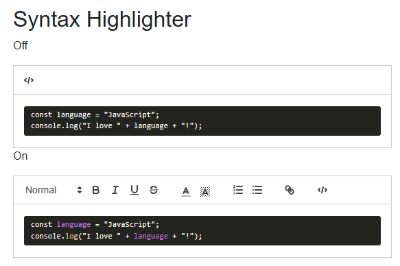

<!-- Blazored - Text Editor -->

Today I added _Syntax Highlighting_ to **Blazored TextEditor**.



I'd been trying out some of the **Blazored** components in a recent app and needed a WYSIWYG editor, luckily they had one using [QuillJS](https://quilljs.com/).

When looking at the docs, I'd seen there was an option to add a code block (<kbd></></kbd>) to the editor. But this didn't provide any Syntax Highlighting via the current Blazor config.

```html
<span class="ql-formats">
    <button class="ql-code-block"></button>
</span>
```

I raised an issue asking the question [#79](
https://github.com/Blazored/TextEditor/issues/79). The chief maintainer replied very quickly so I made a start.

In their API for [syntax](https://quilljs.com/docs/modules/syntax) it looked to be a simple addition to the `modules` object.

I took a look at how it was being implemented in C# and started working on a new branch. Not long after I had made a PR and it was approved and merged.

- https://github.com/Blazored/TextEditor/pull/80

Just waiting for a NuGet key to be updated and there should be a new version available soon.

See my docs on how to implement it for your sites:

<?# Markdown ?>
<?!^ "https://raw.githubusercontent.com/Blazored/TextEditor/refs/heads/main/docs/SyntaxHighlighterExample.md" /?>
<?#/ Markdown ?>

- https://github.com/Blazored/TextEditor/blob/main/docs/SyntaxHighlighterExample.md
