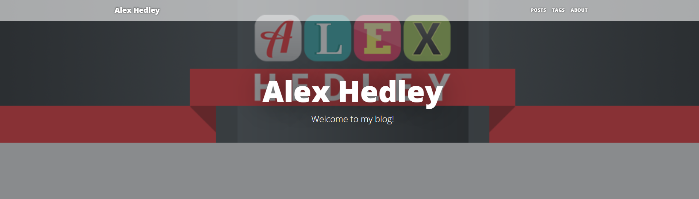

Create a new banner image.

Add a new property `"Image": "images/banner.png",` to the `appsettings.json`

<?# IncludeCode "./../../appsettings.json" /?>

The publish.

I took the banner from my website: [https://www.alexhedley.com/](https://www.alexhedley.com/), might need to create a new one to handle positioning of the text better, but it's not the default anymore.

Example:

