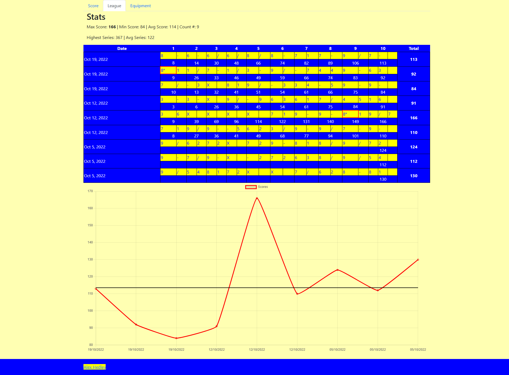

<!-- # Bowling Scores - Graphs -->

Added a graph to my [Bowling Scores](https://alexhedley.com/bowling/) website for the **League** portion.

I used [Chart.js](https://www.chartjs.org/) with some awesome plugins of [Annotation](https://github.com/chartjs/chartjs-plugin-annotation) and [Data Labels](https://github.com/chartjs/chartjs-plugin-datalabels) to plot each week with my average.

## 🔗 Links

- https://alexhedley.com/bowling/
- https://github.com/AlexHedley/bowling