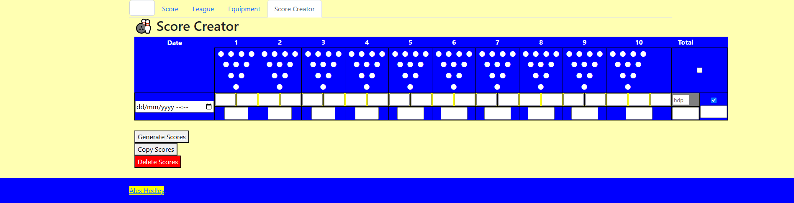

<!-- # Bowling Scores - Score Creator -->

As the bowling scores are just `json` files in a [data](https://github.com/AlexHedley/bowling/tree/main/src/data) 📂 folder so I can host it on GitHub Pages, I have to manually create the object. Normally I would just copy an existing _record_ and amend, but I thought it would be nice to have a quick/easy way of doing this so I took the original component, added some inputs and then built a tool to do it. Don't ask me why I didn't bind the thing, vanilla JS FTW. Still got to work on the pins.

## 🔗 Links

- https://alexhedley.com/bowling/
- https://github.com/AlexHedley/bowling
