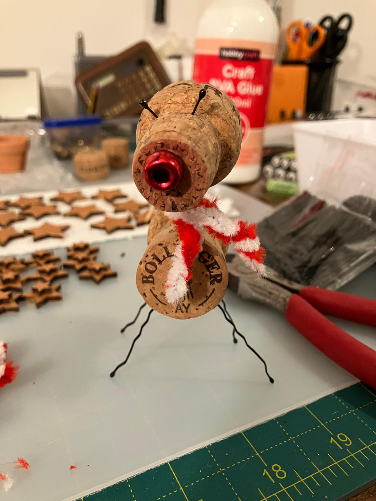
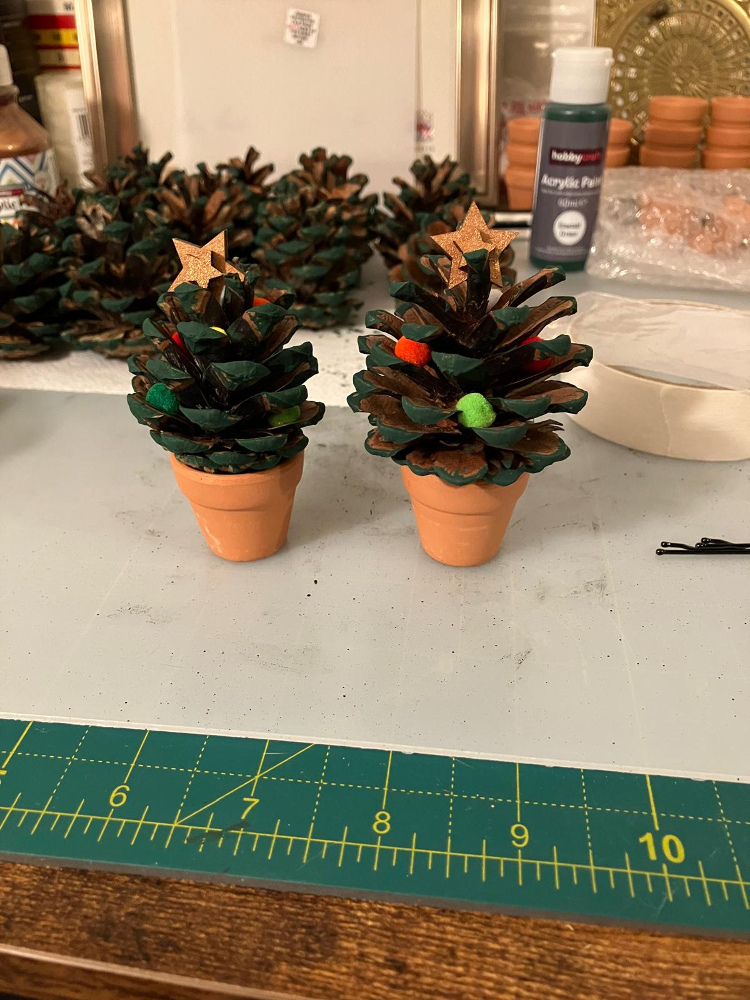
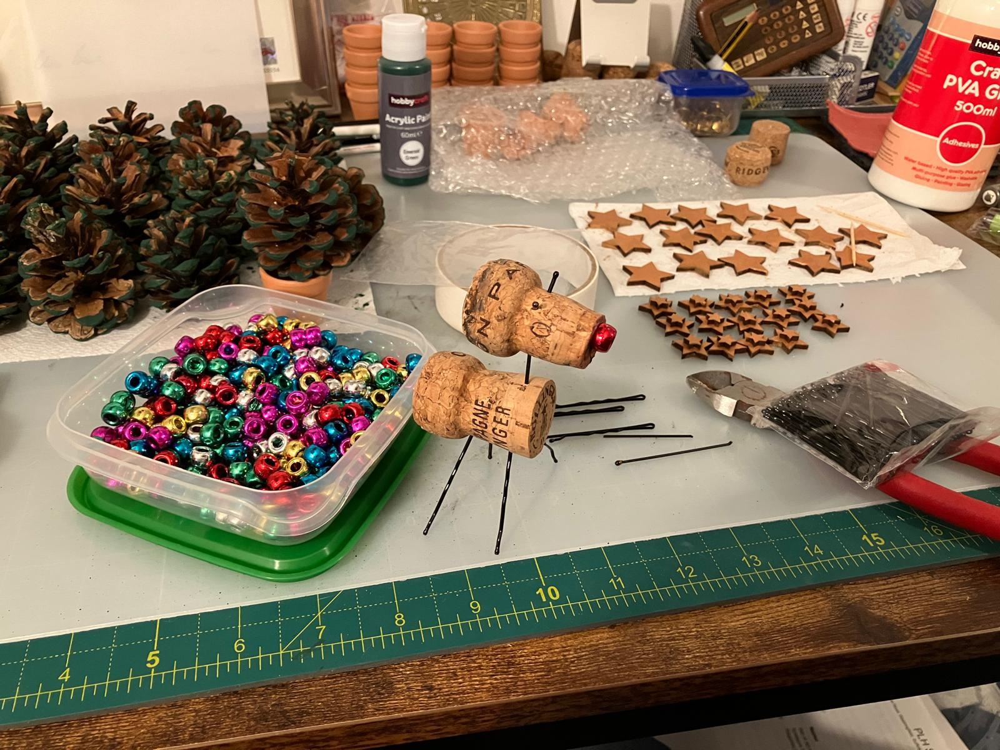

# Christmas Gifts

## Supplies

- Champagne Cork
- Wine Cork
- Hairclip
- Red Beads
- Matchsticks
- Brown paint
- Red/White pipe cleaners

- Mini terracotta pot
- Pine cone
- Mini pompoms (various colours)
- mdf star (various sizes)
- Green paint
- Gold paint

- PVA glue

- Wire cutters

## Steps

### 🦌 Reindeer

Cut some hairclips in half, use the wiggly pieces as legs. Cut the other ends off as the eyes and a smaller piece for the neck.

Add eyes to Champagne cork and antlers from the match sticks (need to re-think these).

Add a bright red nose

Cut a pipe cleaner down to size and add around the neck as a scarf.

### 🎄 Tree

Paint the tips of the pine code green

Stuff different colour pom poms around the cone.

Paint 2 different sized mdf wooden stars gold / bronze and stick together, then glue near the top.

Glue the pine cone to the terracotta pot. (You could use a cork instead)

## Outcome

<!-- ### Stages -->

<!--  -->

## Approx Cost

- ?

<!-- ## Inspired -->
