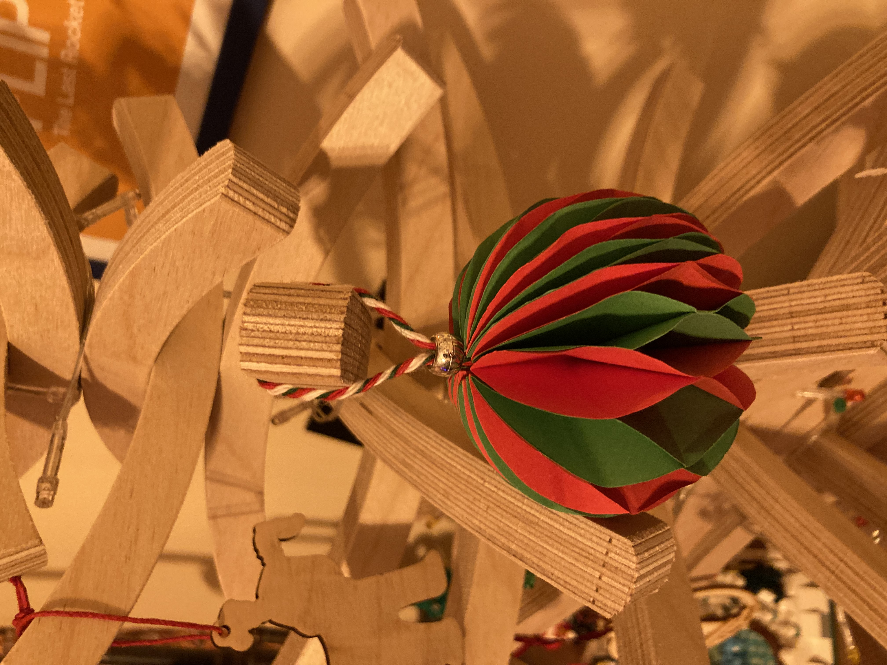
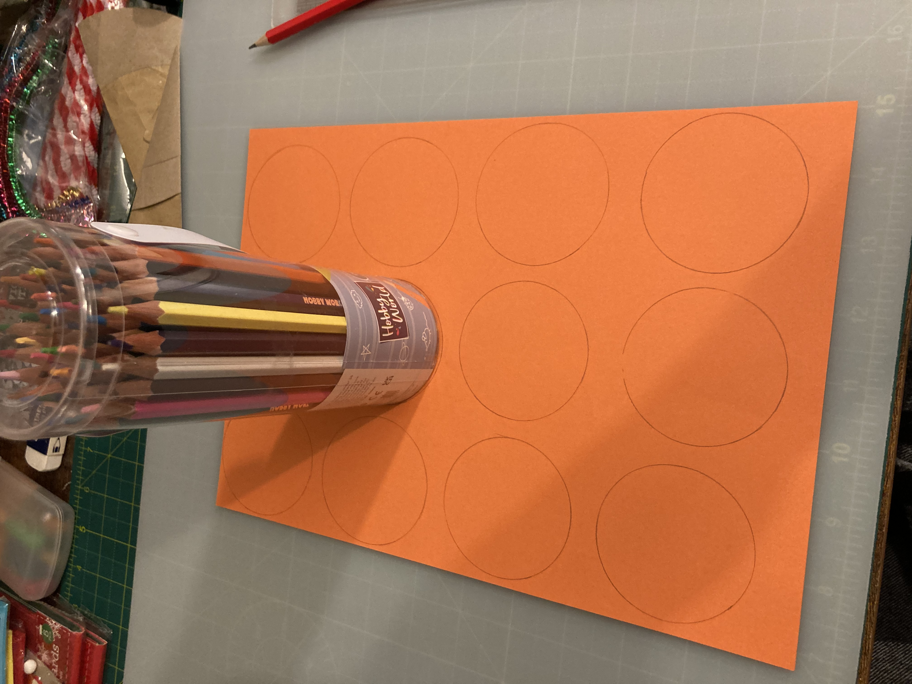
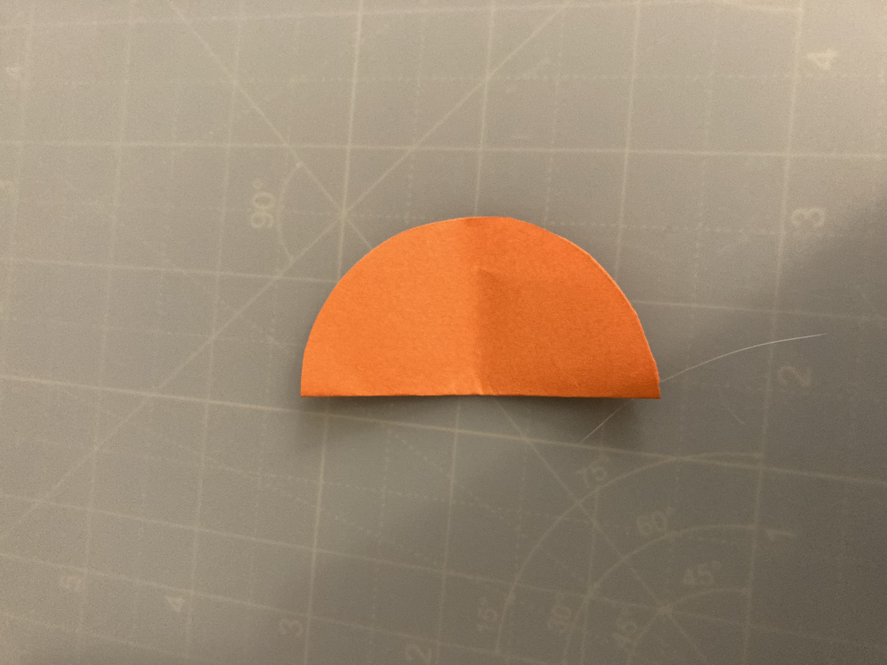
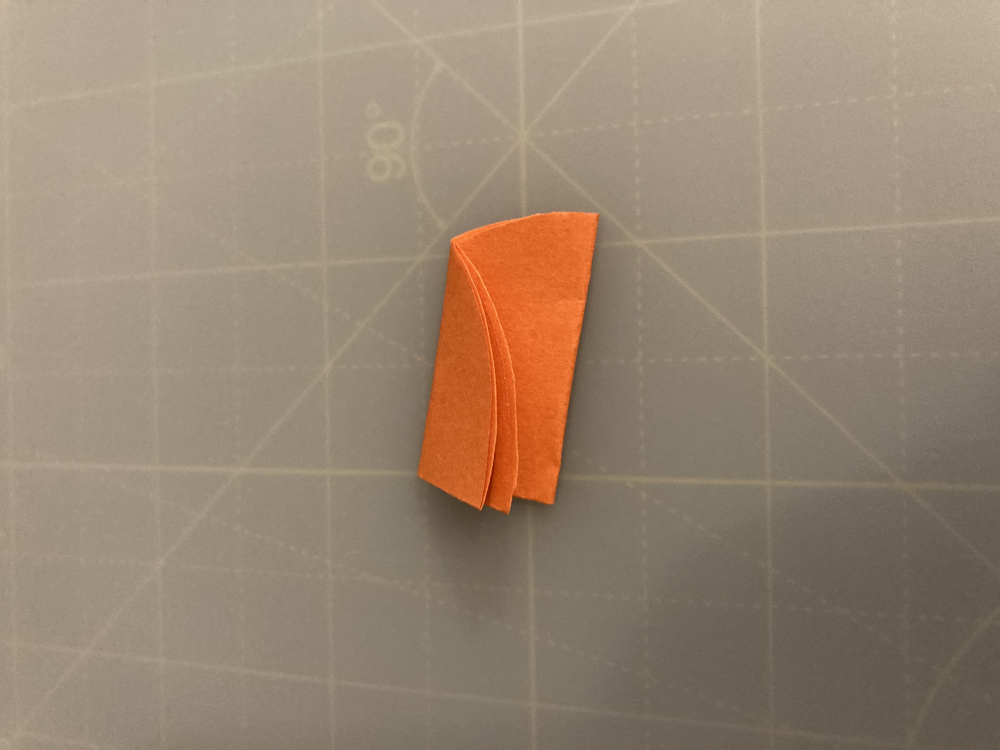
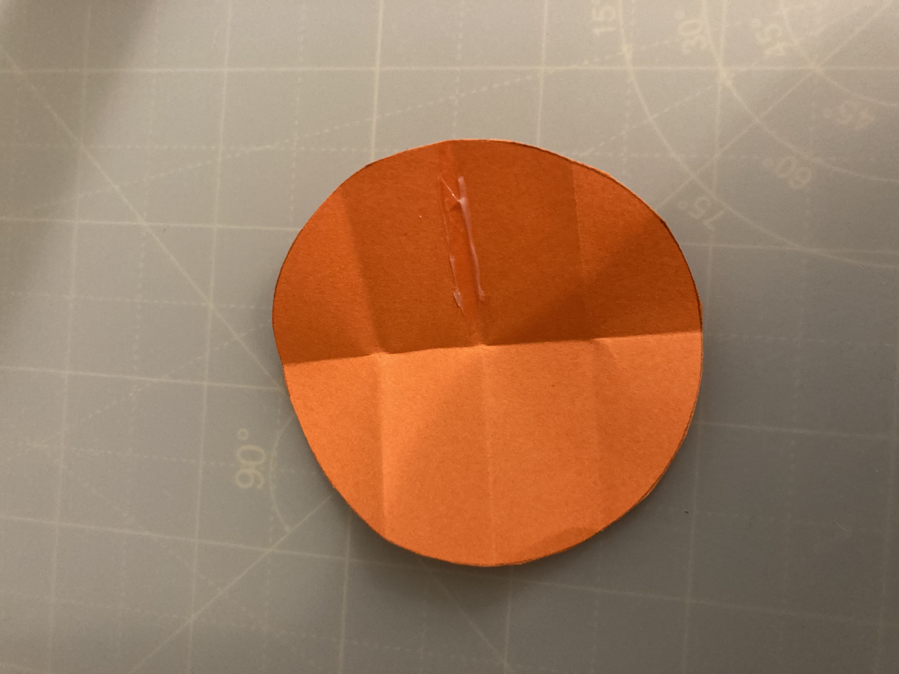
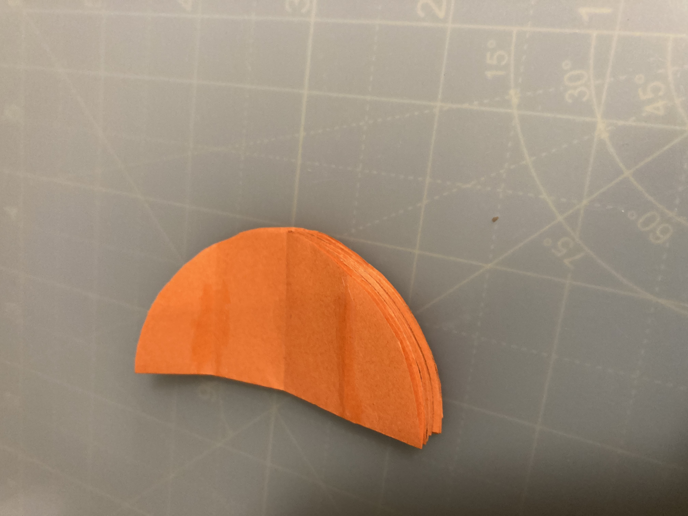

# Christmas Decoration

## Supplies

- 2x sheets Orange paper
- Pencil
- Scissors
- Pritt Stick / Glue
- String
- 2x Gold Beads

## Steps

Draw some circles

Cut out the circles

Fold in half

Fold in half again

Fold in half again

Open back out

Glue the center down and stick single circle together

Glue down top and bottom creases and attach to another circle

Repeat till all are done, then join ends together

Feed a bead through the string, feed through center of ball, add another bead, tie top

## Outcome

### Stages

## Approx Cost

- ?

## Inspired

- https://www.instagram.com/reel/CWtFB5woUaH/