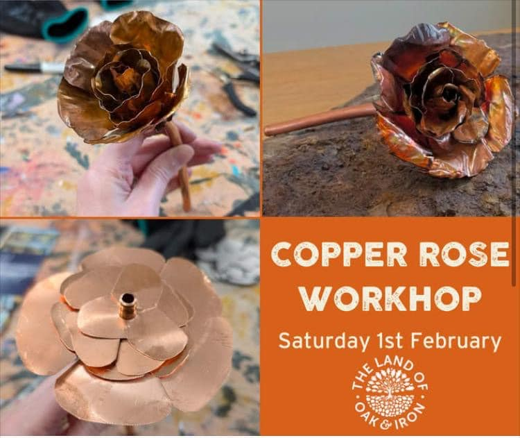
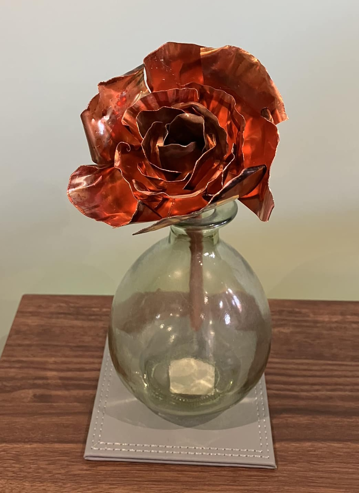

<!-- Copper Rose Workshop -->

- https://facebook.com/events/s/copper-rose-workshop/2753565598184924/

True North Trades are back - this time they're working with copper to create beautiful roses, ideal as a Valentine's or Mother's Day gift.  The workshop would also make a great gift too.

'True North Trades' consists of a Blacksmith, Furniture Maker/Woodworker and a General Handyman, they specialise in a range of products, building talents and activities.

We're really pleased that they will be joining us at the Heritage Centre to run more of their metalworking workshops.

In this workshop you will be taught how to cut out your blanks with tin snips so a degree of strength in the hand will be needed.  You will learn how to shape and solder your blanks into a beautiful copper rose that can be taken away and admired forever.
So why not treat yourself to this great workshop - learning a new skill and taking away something special that you have hand-made yourself.

Come along with a friend, or maybe buy the workshop experience as a unique gift for someone special.
Tickets £40 including all materials. Limited places and booking essential.

These workshops booked up quickly last time, so please reserve your place as soon as possible to avoid missing out.
For adults and older children (aged 14+) and must be able to have a degree of strength to cut out the blanks.
Under 16s must be accompanied by an adult).

WWW.LANDOFOAKANDIRON.SHOP

## 🔗 Links

- https://truenorthtrades.co.uk/
- https://landofoakandiron.org.uk/
