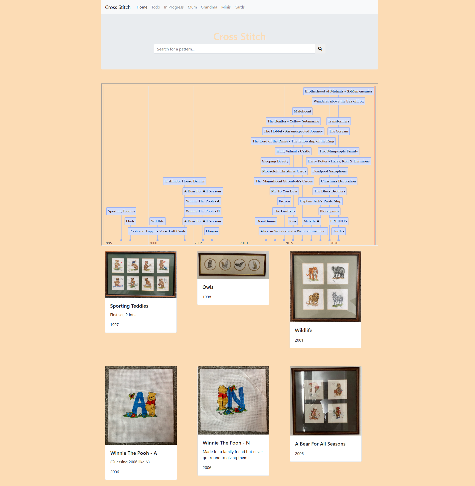

My longest hobby is probably Cross Stitch. My first framed piece is from 1997, 27 years and counting isn't bad going. This set was made up of two 4 packs of various sports, I think the baseball had LA on it and I just did A for my initial.

I've added a cool timeline ([vis.js timeline](https://visjs.github.io/vis-timeline/)) showing when each was made.

There are a number of tabs (which doesn't work on mobile :s) showing my Mum's, Grandma's and I think Great Grandma's from 1897!

- https://alexhedley.com/crossstitch/
  - https://github.com/AlexHedley/crossstitch/

