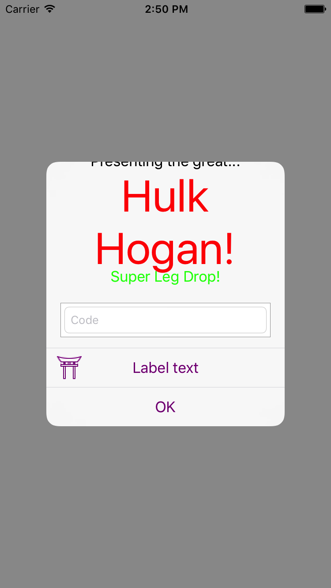
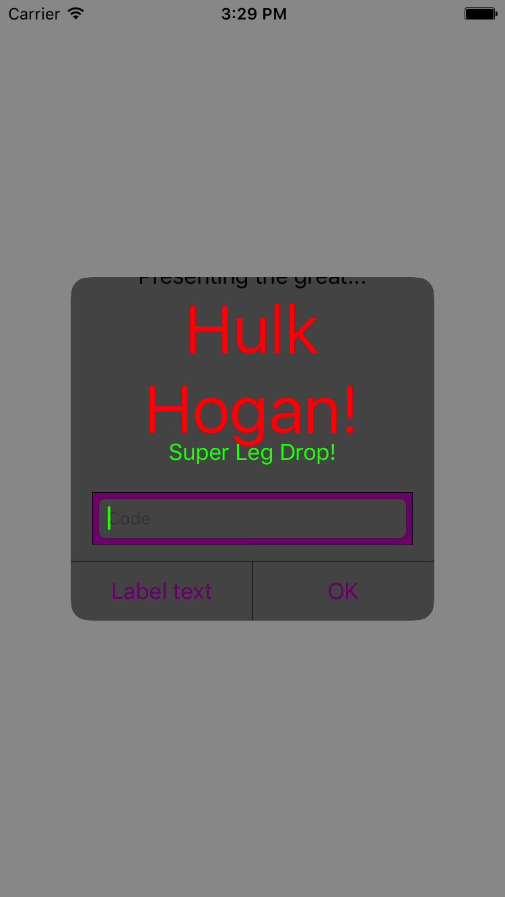

Custom UIAlertController in Objc

[gist 7dbb81c526aa3facceb461ea3a19d83e /]

`Alert.m`

```objectivec
//http://hayageek.com/uialertcontroller-example-ios/

- (void)alert {
    UIAlertController *alert = [UIAlertController alertControllerWithTitle:@"Info" message:@"You are using UIAlertController" preferredStyle:UIAlertControllerStyleAlert];
        
    UIAlertAction *ok = [UIAlertAction actionWithTitle:@"OK"
                                                 style:UIAlertActionStyleDefault
                                               handler:^(UIAlertAction * action)
                         {
                             [alert dismissViewControllerAnimated:YES completion:nil];
                         }];
    
    UIAlertAction *cancel = [UIAlertAction actionWithTitle:@"Cancel"
                                                     style:UIAlertActionStyleCancel
                                                   handler:^(UIAlertAction * action)
                             {
                                 [alert dismissViewControllerAnimated:YES completion:nil];
                             }];
    [cancel setValue:[UIColor redColor] forKey:@"titleTextColor"];
    
    [alert addAction:cancel];
    [alert addAction:ok];
    [alert setPreferredAction:ok];
        
    [self presentViewController:alert animated:YES completion:nil];
}
```

`CustomAlert.m`

```objectivec
- (void)showAlert {
    // http://stackoverflow.com/a/26530577/2895831
    UIAlertController *alertVC = [UIAlertController alertControllerWithTitle:@"Dont care what goes here, since we're about to change below" message:@"" preferredStyle:UIAlertControllerStyleAlert]; //UIAlertControllerStyleActionSheet
    NSMutableAttributedString *hogan = [[NSMutableAttributedString alloc] initWithString:@"Presenting the great... Hulk Hogan!"];
    [hogan addAttribute:NSFontAttributeName
                  value:[UIFont systemFontOfSize:50.0]
                  range:NSMakeRange(24, 11)];
    
    
    //[[UINavigationBar appearance] setTitleTextAttributes:[NSDictionary dictionaryWithObjectsAndKeys: [UIFont fontWithName:kFont size:17.0f], NSFontAttributeName, titleColor, NSForegroundColorAttributeName, nil]];
    [hogan addAttribute:NSForegroundColorAttributeName value:[UIColor redColor] range:NSMakeRange(24, 11)];
    
    [alertVC setValue:hogan forKey:@"attributedTitle"];
    
    NSMutableAttributedString *hogan2 = [[NSMutableAttributedString alloc] initWithString:@"Super Leg Drop!"];
    [hogan addAttribute:NSFontAttributeName
                  value:[UIFont systemFontOfSize:30.0]
                  range:NSMakeRange(0, [hogan length])];
    
    //[[UINavigationBar appearance] setTitleTextAttributes:[NSDictionary dictionaryWithObjectsAndKeys: [UIFont fontWithName:kFont size:17.0f], NSFontAttributeName, titleColor, NSForegroundColorAttributeName, nil]];
    [hogan2 addAttribute:NSForegroundColorAttributeName value:[UIColor greenColor] range:NSMakeRange(0, [hogan2 length])];
    
    [alertVC setValue:hogan2 forKey:@"attributedMessage"];
    
    UIAlertAction *button = [UIAlertAction actionWithTitle:@"Label text"
                                                     style:UIAlertActionStyleDefault
                                                   handler:^(UIAlertAction *action){
                                                       //add code to make something happen once tapped
                                                   }];
    UIImage *accessoryImage = [UIImage imageNamed:@"someImage"];
    [button setValue:accessoryImage forKey:@"image"];
    
    [alertVC addAction:button];
    
    [alertVC addTextFieldWithConfigurationHandler:^(UITextField *textField) {
        textField.placeholder = NSLocalizedString(@"Code", nil);
        textField.textColor = [UIColor redColor];
        textField.tintColor = [UIColor greenColor];
        textField.clearButtonMode = UITextFieldViewModeWhileEditing;
        textField.borderStyle = UITextBorderStyleRoundedRect;
        textField.keyboardType = UIKeyboardTypeNumberPad;
    }];
    
    [alertVC addAction:[UIAlertAction actionWithTitle:NSLocalizedString(@"OK", nil)
                                                        style:UIAlertActionStyleDefault
                                                      handler:^(UIAlertAction *action)
                                {
                                    UITextField *textField = [alertVC.textFields firstObject];
                                    NSLog(@"%@", textField.text);
                                }]
     ];
    
    //http://stackoverflow.com/a/39853234/2895831
    UIView *firstSubview = alertVC.view.subviews.firstObject;
    UIView *alertContentView = firstSubview.subviews.firstObject;
    for (UIView *subSubView in alertContentView.subviews) { //This is main catch
        subSubView.backgroundColor = [UIColor darkGrayColor]; //Here you change background
    }
    
    [self presentViewController:alertVC animated:YES completion:nil];
    alertVC.view.tintColor = [UIColor purpleColor];
    
    //Change the background color of the UITextField view
    //http://stackoverflow.com/a/30225592/2895831
    for (UIView *textfield in alertVC.textFields) {
        UIView *container = textfield.superview;
        UIView *effectView = container.superview.subviews[0];
        
        if (effectView && [effectView class] == [UIVisualEffectView class]){
            container.backgroundColor = [UIColor purpleColor]; //[UIColor clearColor];
            //[effectView removeFromSuperview];
        }
    }
}
```

- http://hayageek.com/uialertcontroller-example-ios/
- https://iosdevcenters.blogspot.com/2016/05/hacking-uialertcontroller-in-swift.html

[gallery ids="976,981" type="rectangular"]




You can change the background colour of the Alert too.

Change the colour of added controls like UITextField too!

_Links_

Hacking UIAlertController in Swift. https://iosdevcenters.blogspot.com/2016/05/hacking-uialertcontroller-in-swift.html

UIAlertController custom font, size, color http://stackoverflow.com/a/26530577/2895831
