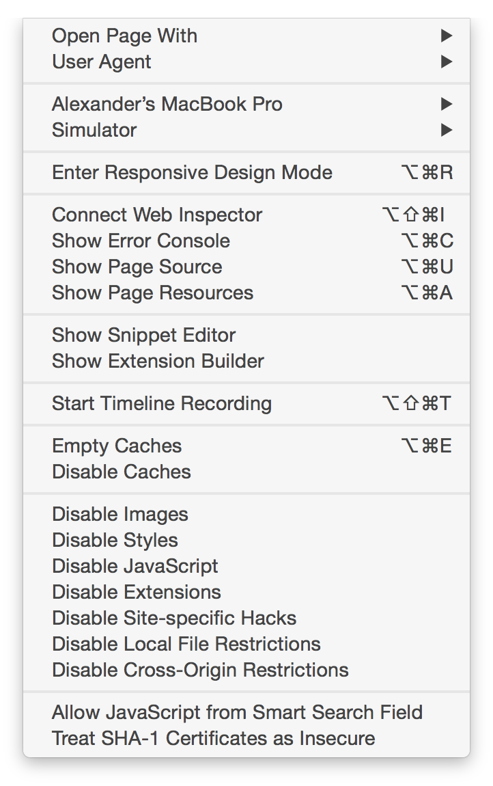
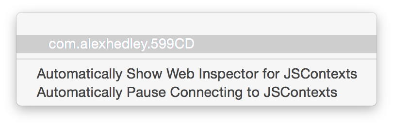
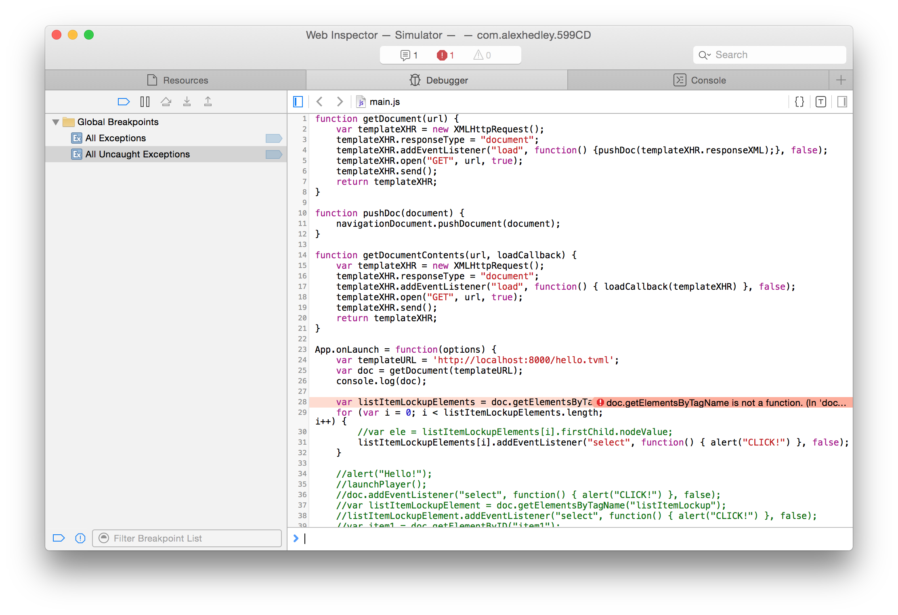

If you download and open the Readme.md of the [TVML Catalog](https://developer.apple.com/library/prerelease/tvos/samplecode/TVMLCatalog/Introduction/Intro.html#//apple_ref/doc/uid/TP40016505)

> To help debug and experiment, you can use the Safari WebInspector to attach to the JavaScript context. WebInspector provides you with a full JavaScript debugging environment. You will need to turn on the Develop menu from Safari > Preferences > Advanced. Select your device from the Develop drop down menu to see a list of running JavaScript contexts.

You will need to [download](https://developer.apple.com/downloads/?q=safari) Safari 9.

Start your client app

`python -m SimpleHTTPServer 8000`

Run your Xcode app.

Now open Safari

Turn on the Develop tab, explained above.

Then go to the **Simulator** | <App>

Now you will see the Web Inspector.

Debug to your hearts content.

 [Original Link](https://alexhedley.wordpress.com/2015/09/14/debugging-a-tvml-tvos-app/)
