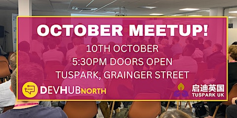
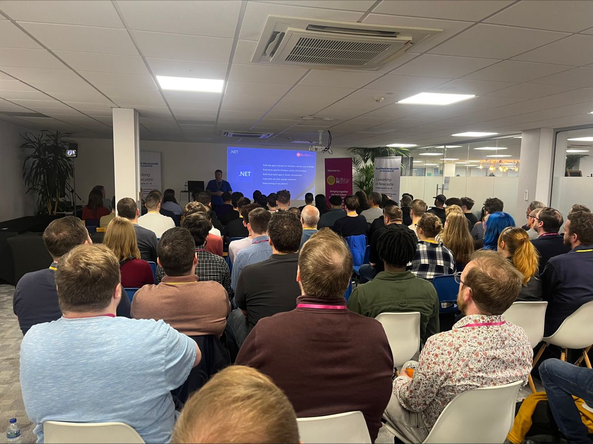

<!-- # DevHubNorth - Oct 2023 -->

## Details

We are so excited to announce our next in-person event & welcome back all developers, tech professionals, students & anyone else who has an interest in tech, at our regular venue - TusPark on Grainger Street!

Devhub North is a great opportunity for you to network with like-minded tech professionals and enjoy some great pizzas and beers while hearing from two inspiring speakers discussing hot topics within the tech industry! 🍕

The doors open at 5:30pm which gives you time to grab a drink, settle in, and network before our first talk at 6pm!

What's in it for you?

- Hear from some industry experts

- Network with like-minded professionals & build some great friendships

- Free pizza & beers

- Knowledge sharing

- Lanyards for easier networking

Make sure you sign up early to secure your spot & we will have your lanyard ready for you on the day 👊

SPEAKERS & TOPICS:

🌟 Speaker: Peter Bull at Bede Gaming 🌟

Peter Bull is a Software Engineer for Bede Gaming and is also an experienced speaker, creates and shares tutorials and workshops along with writing articles and hosting his own podcast! Peter has been a .NET developer for over twenty years since it was first released and has used it to create many things over the years from content generation to web services. Peter also has a passion for Microsoft in general including their obsolete devices such as Zune and Windows Phone along with developing with experiences such as Spotify.

TOPIC: Blazor a trail with .NET 8

In this talk, you will get an introduction to .NET which is Microsoft's platform for developing apps and services along with seeing what will be coming in the latest version .NET 8. There will also be a focus on Blazor for developing web applications using .NET and you'll get to see a demo which will show off many upcoming and existing features of .NET 8!

🌟 Speaker: Gary Brown at AND Digital 🌟

Gary Brown is an experienced Cloud Architect at AND Digital, with over 17 years of IT experience. He spent most of his career in the NHS as a Java developer and transitioned to architecture six years ago. Previously, Gary worked as an NHS/Gov.UK technical assessor, which gave him a deep understanding of the unique challenges faced by government agencies and healthcare providers when it comes to IT systems. With a passion for development and cloud architecture, Gary has led development teams and engaged with businesses at all levels to deliver high-quality services. He has a deep understanding of general architecture principles and is security-minded, ensuring that all systems he designs are secure and compliant with industry standards. With his wealth of experience and expertise, Gary is committed to delivering innovative solutions that meet the unique needs of his clients.

TOPIC: "Agile IT Architecture Design: Building Efficient and Effective Systems for AWS and Beyond"

Agile IT architecture design is a methodology that can significantly benefit developers when building IT systems, including those deployed on AWS or other platforms. By adopting an agile approach, developers can break down complex systems into smaller, more manageable components that can be developed and tested independently. This allows for greater collaboration and flexibility within development teams, which can help accelerate the delivery of new features and improvements to end users. Additionally, an agile approach can help developers respond quickly to changes in user requirements or market conditions, enabling them to iterate and improve on their systems more rapidly. Overall, embracing agile IT architecture design can help developers create more efficient, effective, and adaptable IT systems that meet the needs of their customers.

We look forward to seeing you all there!👋

Your Devhub North Team

## Links

- https://www.eventbrite.co.uk/e/devhub-north-october-meetup-tickets-728285029127
  - https://www.eventbrite.co.uk/o/ronald-james-group-28239187209
- https://www.linkedin.com/posts/lucy-kay-514641174_tech-event-networking-ugcPost-7117802381978832898-cOCW/

- https://www.devhubnorth.com/
- https://www.linkedin.com/company/devhubnorth/
