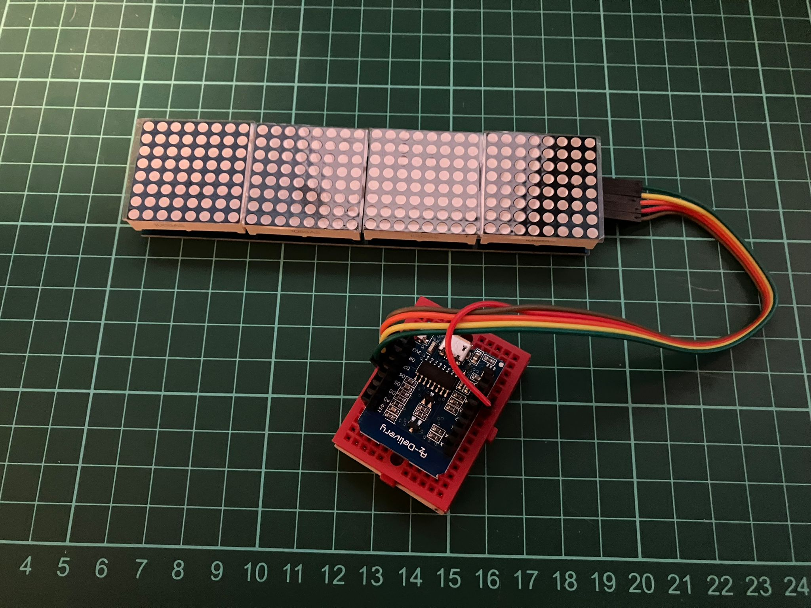
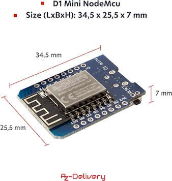
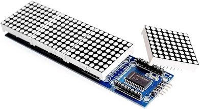
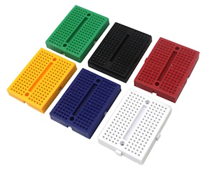

<!-- # Dot Matrix -->

After watching a [Frank Krueger](https://www.twitch.tv/frankkrueger) Twitch stream I bought some more electronics. This time a Dot Matrix Module to display some cool information. I also bought an ESP8266 for the brains of it, and some mini breadboards to add to the collection of kit.

## Code

- https://github.com/praeclarum/BuildMatrix
- https://github.com/praeclarum/BuildBoard

<?# Twitter 1164251822720032769 /?>

https://twitter.com/praeclarum/status/1164251822720032769

<!-- <blockquote class="twitter-tweet">
I made a build status IoT thing! Automatically polls <a href="https://twitter.com/bitrise?ref_src=twsrc%5Etfw">@bitrise</a> and is even Alexa controlled (for brightness and to turn off).  Now I want to add github issue and PR counts.   Just a $12 ESP32 and a $30 led matrix. <a href="https://t.co/trzkVoGmXB">pic.twitter.com/trzkVoGmXB</a>
&mdash; Frank A. Krueger (@praeclarum) <a href="https://twitter.com/praeclarum/status/1164251822720032769?ref_src=twsrc%5Etfw">August 21, 2019</a></blockquote>  -->

<!-- <blockquote class="twitter-tweet" data-media-max-width="560">
I made a build status IoT thing! Automatically polls <a href="https://twitter.com/bitrise?ref_src=twsrc%5Etfw">@bitrise</a> and is even Alexa controlled (for brightness and to turn off).  Now I want to add github issue and PR counts.   Just a $12 ESP32 and a $30 led matrix. <a href="https://t.co/trzkVoGmXB">pic.twitter.com/trzkVoGmXB</a>
&mdash; Frank A. Krueger (@praeclarum) <a href="https://twitter.com/praeclarum/status/1164251822720032769?ref_src=twsrc%5Etfw">August 21, 2019</a></blockquote>  -->

## Products

AZDelivery D1 Mini NodeMcu WiFi Board ESP8266-12F CH340G WLAN ESP8266 Micro USB Lua Module 3.3V 500mA compatible with Arduino Including E-Book!

https://www.amazon.co.uk/gp/product/B01N9RXGHY/

£4.79

DollaTek Dot Matrix Module For Arduino Microcontroller 4 In 1 Display with 5pin Line

https://www.amazon.co.uk/gp/product/B07DK73BWY/

£8.99

12PCS 170 tie-Points Mini Breadboard kit for Prototype Shield,Solderless Prototype PCB Board,6 Color Breadboard Set

£7.99
