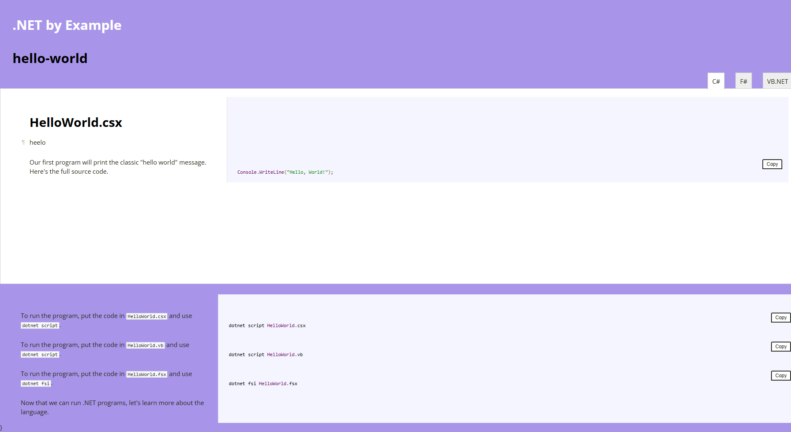

<!-- .NET by Example -->
<!--  -->

In this post I will explain how I built **.NET by Example**, a clone of [Go by Example](https://gobyexample.com/), using the updated [nocco](dotnet-nocco) tool I've recently been working on.

I've modified the code a little to take a list of files: `.cs`, `.vb`, `.fs`, in a folder, with a `.bat` to explain how to run the provided scripts and it builds a tabbed page of each of the files.

It also has a _copy_ button option to make working with the code a little easier.

The home page is then built with the list of the examples.

If you have any ideas of other examples please add a new 💡[Discussion](https://github.com/AlexHedley/dotnetbyexample/discussions/new?category=ideas) item. I'll be working on adding more in the near future.

I added a build and deploy [script](https://github.com/AlexHedley/dotnetbyexample/blob/main/.github/workflows/build-deploy.yml) via GitHub Actions and deployed it via GitHub Pages: https://alexhedley.github.io/dotnetbyexample.

## </> Code

- https://alexhedley.github.io/dotnetbyexample
  - https://github.com/AlexHedley/dotnetbyexample

## 🔗 Links

- https://github.com/mmcgrana/gobyexample
  - https://gobyexample.com/
