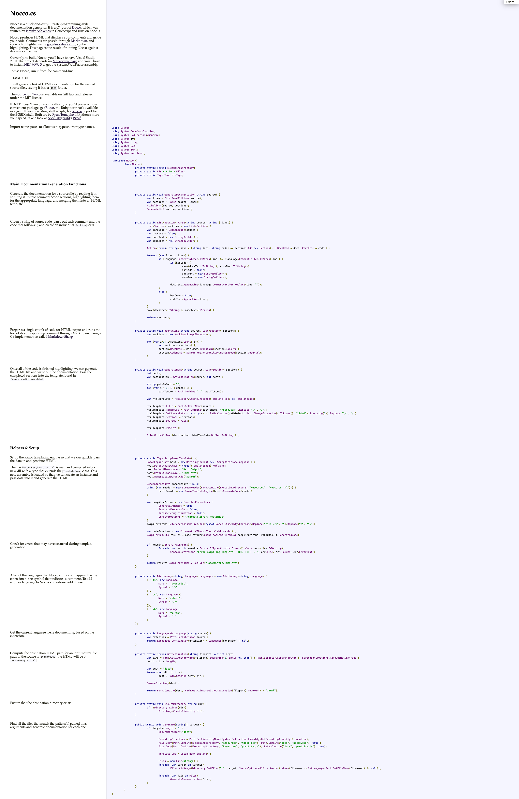

<!-- .NET nocco -->
<!--  -->

In this post I will talk through how I updated Don Wilson's ([@dontangg](https://github.com/dontangg)) **nocco** from .NET Framework v4.0 to .NET (Core) v9.

So what is nocco? It's a .NET port of [Docco](https://ashkenas.com/docco/). What is Docco?

> Docco is a quick-and-dirty documentation generator, written in [Literate CoffeeScript](https://coffeescript.org/#literate). It produces an HTML document that displays your comments intermingled with your code. All prose is passed through [Markdown](http://daringfireball.net/projects/markdown/syntax), and code is passed through [Highlight.js](http://highlightjs.org/) syntax highlighting. This page is the result of running Docco against its own [source file](https://github.com/jashkenas/docco/blob/master/docco.litcoffee).

> Nocco is a quick-and-dirty, literate-programming-style

You can see an original output of `nocco.cs` on http://donwilson.net/nocco/.



What does it do? The original takes a list of files, these could be C#, VB.NET, SQL or JS and produces a side by side view of code comments and their respective code.

From the `nocco.cs` page at the Razor section their notes are the following:

> Setup the Razor templating engine so that we can quickly pass the data in and generate HTML.
> The file `Resources\Nocco.cshtml` is read and compiled into a new dll with a type that extends the `TemplateBase` class. This new assembly is loaded so that we can create an instance and pass data into it and generate the HTML.

This file was then executed to produce the output, along with the html documentation and syntax highlighted code, you can read more about it on the linked page or in the code itself.

I've got some experience with building DLLs using `Microsoft.CodeAnalysis.CSharp` when I built [BlazorInteractive](https://github.com/alex-hedley/BlazorInteractive) but this has changed a little from the original `CSharpCodeProvider` used here.

For the first pass I thought it might be easier to not have the code be compiled in the same way, instead I'll just build a Razor page, like before, and then pass the data I needed. Luckily [Rob Anderson](https://robanderson.dev/) had told me about a method he'd used to do this:

- Render Razor components outside of ASP.NET Core
  - https://learn.microsoft.com/en-us/aspnet/core/blazor/components/render-components-outside-of-aspnetcore?view=aspnetcore-9.0

[`HtmlRenderer`](https://learn.microsoft.com/en-us/dotnet/api/microsoft.aspnetcore.components.web.htmlrenderer?view=aspnetcore-9.0) to the rescue.

I made the project use the SDK: `Microsoft.NET.Sdk.Razor` then added the `Microsoft.AspNetCore.Components.Web` library.

Next the `GenerateHtml()` method was where I got to work updating. Following the above tutorial was very quick. I renamed the original `Nocco.cshtml` to `Webpage.razor` and added in the corresponding `@code {}` and `[Parameter]`s. This now allows me to pass a `Dictionary` of KVPs matching the Parameter names with the corresponding data types. It didn't like passing the `Func<>` directly as an `object?` so I made it it's own variable and passed that in.

Source: https://github.com/AlexHedley/nocco/blob/d6f7f65e519d66056db67f5c5430f8d9ee94da1a/src/Nocco/Nocco.cs#L116-L153

<!-- https://raw.githubusercontent.com/AlexHedley/nocco/d6f7f65e519d66056db67f5c5430f8d9ee94da1a/src/Nocco/Nocco.cs -->

<details>
<summary>GenerateHtml</summary>

```cs
private static async void GenerateHtml(string source, List<Section> sections)
{
    int depth;
    var destination = GetDestination(source, out depth);
        
    string pathToRoot = string.Concat(Enumerable.Repeat(".." + Path.DirectorySeparatorChar, depth));

    IServiceCollection services = new ServiceCollection();
    services.AddLogging();
    IServiceProvider serviceProvider = services.BuildServiceProvider();
    ILoggerFactory loggerFactory = serviceProvider.GetRequiredService<ILoggerFactory>();
    await using var htmlRenderer = new HtmlRenderer(serviceProvider, loggerFactory);

    var html = await htmlRenderer.Dispatcher.InvokeAsync(async () =>
    {
        Func<string, string> getSourcePath = s =>
            Path.Combine(pathToRoot, Path.ChangeExtension(s.ToLower(), ".html").Substring(2)).Replace('\\', '/');
        var dictionary = new Dictionary<string, object?>
        {
            { "Title", Path.GetFileName(source) },
            { "PathToCss", Path.Combine(pathToRoot, "nocco.css").Replace('\\', '/') },
            { "PathToJs", Path.Combine(pathToRoot, "prettify.js").Replace('\\', '/') },
            { "GetSourcePath", getSourcePath },
            { "Sections", sections },
            { "Sources", _files },
        };

        var parameters = ParameterView.FromDictionary(dictionary);
        var output = await htmlRenderer.RenderComponentAsync<Webpage>(parameters);

        return output.ToHtmlString();
    });
    
    File.WriteAllText(destination, html);
}
```

</details>

Build the app.

Navigate to the folder with your source files in

`nocco *.cs`

Open the newly created `docs` folder and open any of the matching `*.html` files.

### Dependencies

The original also used [MarkdownSharp](https://www.nuget.org/packages/MarkdownSharp/1.13.0) *v1.13.0.0*, I updated this to [MarkdownSharpCore](https://www.nuget.org/packages/MarkdownSharpCore) *v1.2.0* just to make the upgrade easier, I'm contemplating swapping to [Markdig](https://www.nuget.org/packages/MarkDig).

## </> Code

- https://github.com/AlexHedley/nocco
- https://github.com/AlexHedley/nocco-example

## 🔗 Links

- https://github.com/dontangg/nocco
  - http://donwilson.net/nocco/
- https://ashkenas.com/docco/
