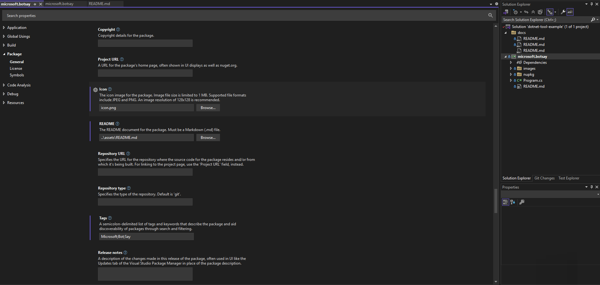
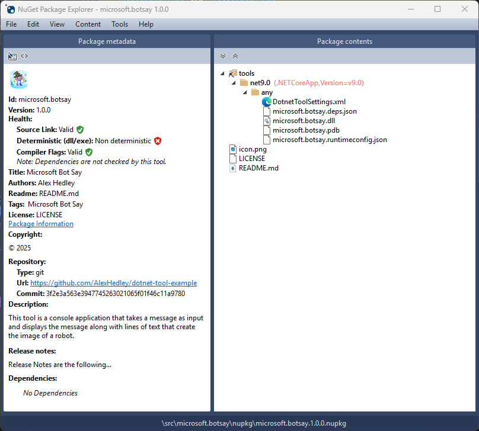

<!-- .NET Tool Example -->
<!--  -->

In this tutorial I will expand on the [Microsoft Learn](https://learn.microsoft.com/en-gb/training/) tutorials site. They give a great starting point for the minimum settings you need but I'll add a couple more I've found useful. See the 🔗 links at the end if you want to run through them.

Once you have created a new .NET exe, aka Console App, you can start updating the necessary config.

On the `.csproj` click <kbd>Alt</kbd> + <kbd>Enter</kbd> or *Right-Click* **Properties**.

Scroll down to **Package** and complete the properties you require.
This will update the underlying `.csproj` or you could change them there directly but be careful as some only allow certain values.

In the original Tutorial they suggest the following:

```xml
<PackAsTool>true</PackAsTool>
<ToolCommandName>botsay</ToolCommandName>
<PackageOutputPath>./nupkg</PackageOutputPath>
```

Which is the minium you need, but I like to add a few more i.e. the ones below, to add an icon, tags, description etc to make it easier for your consumers and yourself to know what the app does.

**General**

| Name | Description | Property |
| - | - | - |
| Generate NuGet package on build | Produce a package file during build operations.| `GeneratePackageOnBuild` |
| Package ID | The case-insensitive package identifier, which must be unique across nuget.org or whatever gallery the package resides in. IDs may not contain spaces or characters that are not valid for a URL, and generally follow .NET namespace rules. | `PackageId` | 
| Title | A human-friendly title of the package, typically used in Ul displays as on nuget.org and the Package Manager in Visual Studio. | `Title` | 
| Package Version | The version of the package, following the major.minor.patch pattern. Version numbers may include a pre-release suffix. | `Version` | 
| Authors | A comma-separated list of packages authors, matching the profile names on nuget.org. These are displayed in the NuGet Gallery on nuget.org and are used to cross-reference packages by the same authors. | `Authors` | 
| Company | | `Company` | 
| Product | | `Product` | 
| Description | A description of the package for UI display. | `Description` | 
| Copyright | Copyright details for the package. | `Copyright` | 
| Project URL | A URL for the package's home page, often shown in UI displays as well as nuget.org. | `PackageProjectUrl` | 
| Icon | The icon image for the package. Image file size is limited to 1 MB. Supported file formats include JPEG and PNG. An image resolution of 128x128 is recommended. | `PackageIcon` | 
| README | The README document for the package. Must be a Markdown (.md) file. | `PackageIcon` | 
| Repository URL | Specifies the URL for the repository where the source code for the package resides and/or from which it's being built. For linking to the project page, use the 'Project URL' field, instead. | `RepositoryUrl` | 
| Repository type | Specifies the type of the repository. Default is 'git'. | `RepositoryType` | 
| Tags | A semicolon-delimited list of tags and keywords that describe the package and aid discoverability of packages through search and filtering. | `PackageTags` |
| Release notes | A description of the changes made in this release of the package, often used in UI like the Updates tab of the Visual Studio Package Manager in place of the package description. | `PackageReleaseNotes` |
| Pack as a .NET tool | Packs this project as a special package that contains a console application that may be installed via the "dotnet tool" command. | `PackAsTool` |
| NET tool command name | The command name via which the .NET tool will be invoked on the command line. | `ToolCommandName` |
| Package Output Path | Determines the output path in which the package will be dropped. | `PackageOutputPath` |
| Assembly neutral language | (None) | `NeutralLanguage` |
| Assembly version | | `AssemblyVersion` |
| File version | | `FileVersion` |

**License**

| Name | Description | Property |
| - | - | - |
| Package License | Specify a license for the project's package. | None<br/>SPDX License Expression<br/>Embedded File |
| License file |  | `PackageLicenseFile` |
| Require license acceptance | Prompt the user to accept the license when installing this package | `PackageRequireLicenseAcceptance` |
| License expression | An SPDX license expression, often shown in UIs like nuget.org | `PackageLicenseExpression` [link](https://spdx.org/licenses/) |

**Symbols**

| Name | Description | Property |
| - | - | - |
| Produce a symbol package | Create an additional symbol package when the project is packed. | `IncludeSymbols` |
| Symbol package format | Specifies the format of the symbols package. | `SymbolPackageFormat` (symbols.nupkg/snupkg) |





This translates to the following:

```xml
<Project Sdk="Microsoft.NET.Sdk">

  <PropertyGroup>
    <OutputType>Exe</OutputType>
    <TargetFramework>net9.0</TargetFramework>
    <ImplicitUsings>enable</ImplicitUsings>
    <Nullable>enable</Nullable>

    <!-- package properties -->
    <PackageId>alexhedley.botsay</PackageId>
    <Version>1.0.0</Version>
    <Authors>Alex Hedley</Authors>
    <Company>Alex Hedley</Company>
    <Product>Microsoft BotSay</Product>

    <Title>Microsoft Bot Say</Title>
    <PackageTags>Microsoft;Bot;Say</PackageTags>
    <Description>This tool is a console application that takes a message as input and displays the message along with lines of text that create the image of a robot.</Description>
    <PackageIcon>icon.png</PackageIcon>
    <PackageReadmeFile>README.md</PackageReadmeFile>
    <PackageRequireLicenseAcceptance>False</PackageRequireLicenseAcceptance>
    <PackageLicenseFile>LICENSE</PackageLicenseFile>
    <!-- <PackageLicenseExpression>MIT</PackageLicenseExpression> -->
    <PackageReleaseNotes>Release Notes are the following...</PackageReleaseNotes>
    <RepositoryType>git</RepositoryType>
    <RepositoryUrl>https://github.com/AlexHedley/dotnet-tool-example</RepositoryUrl>
    <PackageProjectUrl>https://github.com/AlexHedley/dotnet-tool-example</PackageProjectUrl>
    <Copyright>© 2025</Copyright>
    
    <!-- Tool settings -->
    <PackAsTool>true</PackAsTool>
    <ToolCommandName>botsay</ToolCommandName>
    <PackageOutputPath>./nupkg</PackageOutputPath>
    <!-- <GeneratePackageOnBuild>true</GeneratePackageOnBuild> -->
  </PropertyGroup>

  <ItemGroup>
    <None Include="..\..\LICENSE" Pack="true" PackagePath="\" />
    <None Include="images\icon.png" Pack="true" PackagePath="" />
    <None Include="..\assets\README.md" Pack="true" PackagePath="" />
  </ItemGroup>

</Project>
```

Build the app then open the `.nupkg` it in the **NuGet Package Explorer** to confirm if your properties have been set correctly.



If you don't have the app installed you can find it on GitHub or the Microsoft Store.

- https://github.com/NuGetPackageExplorer/NuGetPackageExplorer
- https://apps.microsoft.com/detail/9wzdncrdmdm3

## </> Code

You can download the example I built on *GitHub*.

- https://github.com/AlexHedley/dotnet-tool-example

Release: https://github.com/AlexHedley/dotnet-tool-example/releases/tag/1.0.0  
GitHub nuget: https://github.com/AlexHedley/dotnet-tool-example/pkgs/nuget/alexhedley.botsay  
nuget: https://www.nuget.org/packages/alexhedley.botsay/  

## 🔗 Links

- Tutorial: Create a .NET tool using the .NET CLI
  - https://learn.microsoft.com/en-us/dotnet/core/tools/global-tools-how-to-create
- Tutorial: Install and use a .NET global tool using the .NET CLI
  - https://learn.microsoft.com/en-us/dotnet/core/tools/global-tools-how-to-use
- Tutorial: Install and use a .NET local tool using the .NET CLI
  - https://learn.microsoft.com/en-us/dotnet/core/tools/local-tools-how-to-use
