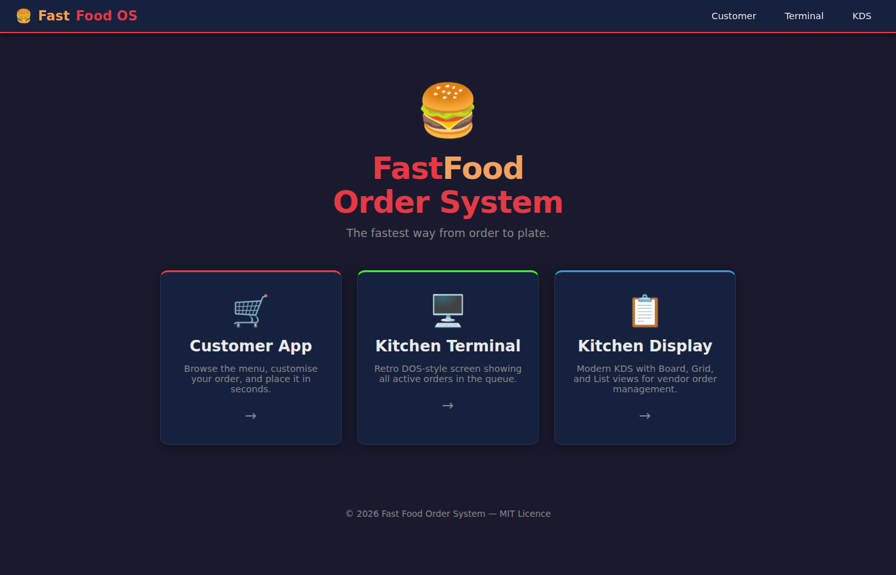
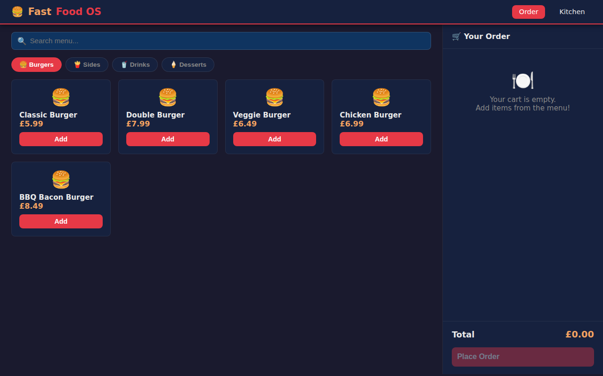
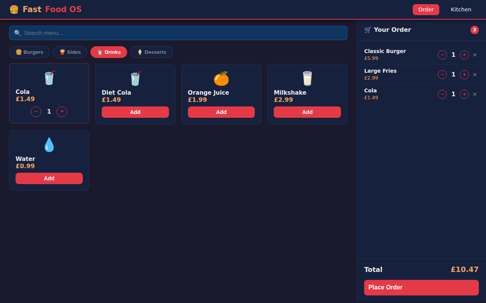
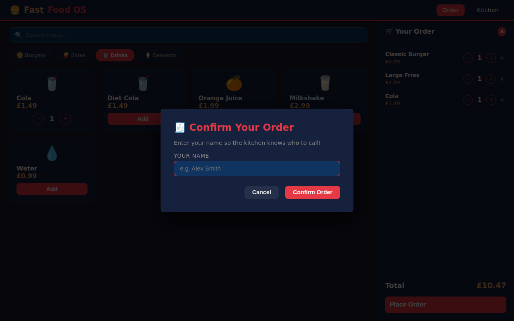
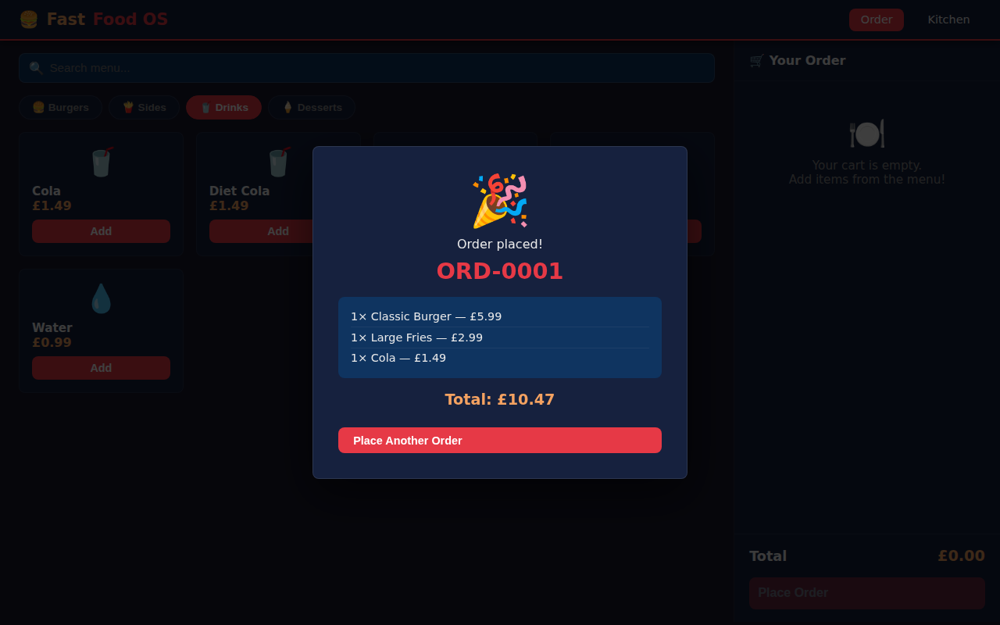
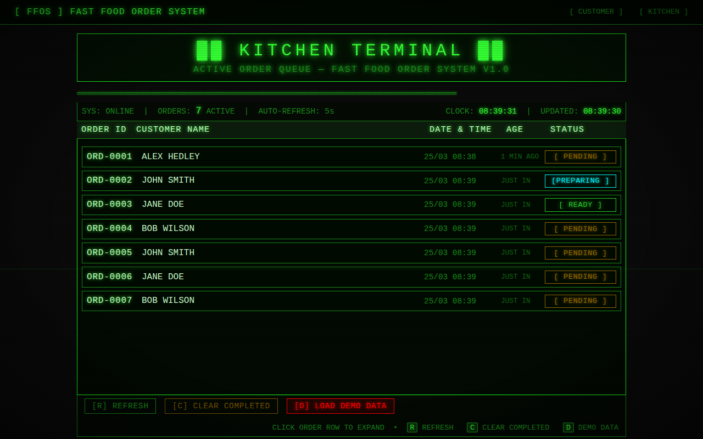
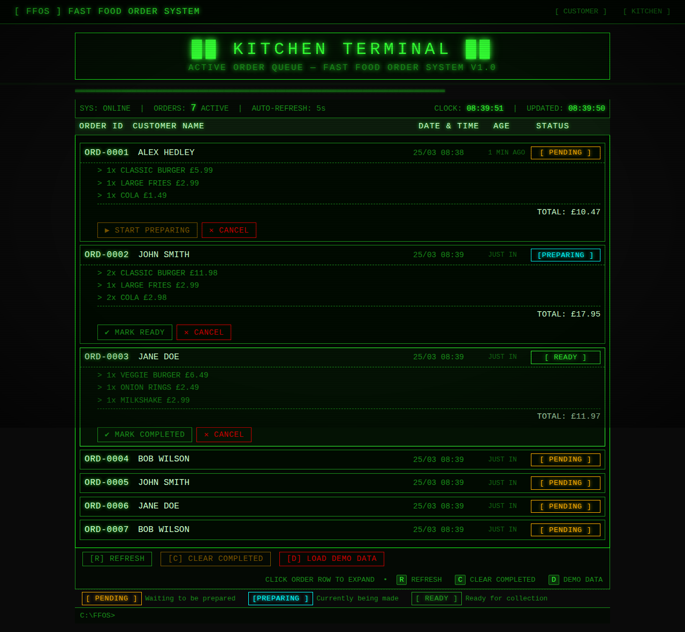
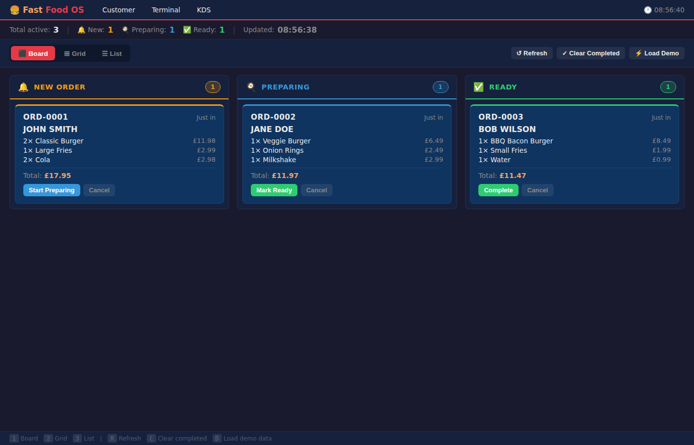
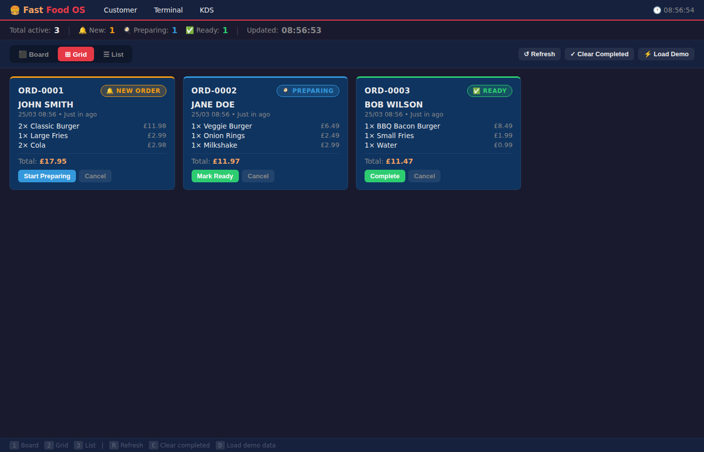
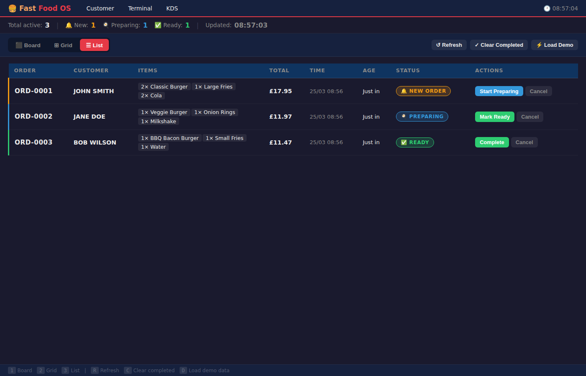

<!-- Fast Food Order System -->

For some strange reason I've wanted to create my own_ Fast Food Order System_, I've always liked how the the terminal looked for the staff, although I never worked in one to raise some beer money.

I used [GitHub Copilot](github-copilot) to build the app with the following prompt:

> Create a vanilla web based fast food ordering system with customer and client apps. Produce the page that shows the valid orders in an old school terminal/dos like screen that lists the choices

Because of the terminal/dos request I got the following, which I LOVE but thinking it won't work well for a touch screen system and thought I need it to look more like the ones I'd expected to see in McD / KFC etc. 

Another prompt:

> create some alternative KDS layouts for the vendors management of the orders

⬛ Board (Kanban) — three columns: New Orders | Preparing | Ready. See the full pipeline at a glance and advance orders with one click.

⊞ Grid — responsive card tiles sorted by urgency, full order details visible without expanding. Orders turn amber at 5 min and pulse red at 10 min.

☰ List — compact table for high-volume kitchens, maximum information density with inline action buttons.

All layouts share the same localStorage order data and auto-refresh every 5 s. Layout preference persists between sessions. Keyboard shortcuts: `1`/`2`/`3` to switch layout, `R` refresh, `C` clear completed, `D` load demo.

Finally I asked for a 🍔 favicon because it's a must!

> Add a favicon

I was very impressed with the design, it would have taken me an age to come up with something that looks as nice, and it implemented some cool functionality to handle state. Just need to build an API and release :p.

## 🔗 Links

- https://github.com/AlexHedley/fast-food-order-system/
  - https://github.com/AlexHedley/fast-food-order-system/pull/1
