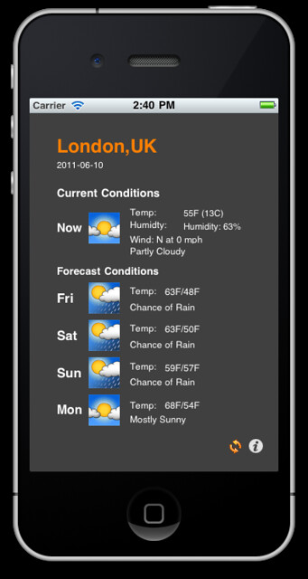

So I finished Chapter 7 yesterday, this one was working with the web browser control (UIWebView), checking for connectivity, sending Email and then getting data from the Internet.

I used the Google Weather service to populate a custom view of Weather info for London. Great set of methods that can be used in further projects.

 (I'll add a video at some point.)

Slowly getting there :)

The Handling Data chapter is next ...

 [Original Link](https://alexhedley.wordpress.com/2011/06/10/finished-chapter-7-of-iphone-programming/)
