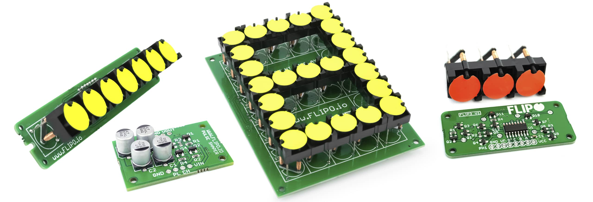
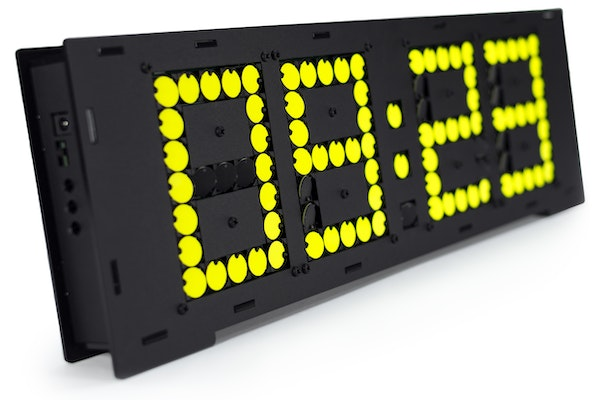

<!-- # Flipo - Kickstarter -->

I've been after a flip-disc setup for quite a while and now there's finally been one released at a reasonable price on Kickstarter - [Flip-disc Displays - Arduino Based](https://www.kickstarter.com/projects/marcinsaj/flip-disc-displays-arduino-based) from [Marcin Saj](https://www.kickstarter.com/profile/marcinsaj).

There's a number of reward options in the campaign, I've gone for the FLIP-DISC CLOCK but I can see me getting others later, would be awesome to build a bigger display.

The timeline is looking good at Feb/Mar 2024 but it's becoming popular so that might delay things, but this will give me time to finish tinkering with all the other projects I haven't started yet!

<?# YouTube n9leTz-2cQg /?>

<!-- <iframe width="560" height="315" src="https://www.youtube.com/embed/n9leTz-2cQg" title="Words - Flip-disc Clock 4 x 7-Segment Display" frameborder="0" allow="accelerometer; autoplay; clipboard-write; encrypted-media; gyroscope; picture-in-picture; web-share" allowfullscreen></iframe> -->

## Code

- https://github.com/marcinsaj/FlipDisc
- https://github.com/marcinsaj

## Links

- https://flipo.io/
- https://nixietester.com/
- https://www.kickstarter.com/projects/marcinsaj/flip-disc-displays-arduino-based
- https://www.youtube.com/@MarcinSaj
