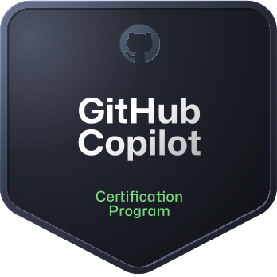

<!-- # GitHub Copilot - Certification -->

<!--  -->

Today I passed the **GitHub Copilot** exam 🎉!

- [MS Learn Badge](https://learn.microsoft.com/en-us/users/alexhedley8/credentials/dd68756f3f2ef4f1)
  - [MS Learn Profile](https://learn.microsoft.com/en-gb/users/alexhedley8/)

The pass mark is 700 and I achieved: **742**.

> This exam evaluates your skill in using the AI-driven code completion tool in various programming languages, certifying your capability to optimize software development workflows efficiently.

I took this in a Pearson VUE testing center.

I took about 30 minutes in total, you do have the option to review answers, which is beneficial, but I didn't want to second guess myself so just submitted.

There wasn't a breakdown like [GitHub Foundations](github-certifications-foundations) but it did tell you your score.

## Training Material

- [GitHub Copilot](https://learn.github.com/certification/COPILOT) GitHub
- [GitHub Copilot](https://learn.microsoft.com/en-us/credentials/certifications/github-copilot/?practice-assessment-type=certification) Microsoft Learn

## Resources

- [ghcertified](https://github.com/FidelusAleksander/ghcertified)
  - [https://ghcertified.com/](https://ghcertified.com/)

## 🔗 Links

- [GitHub Certifications](https://examregistration.github.com/)
- Blog: [GitHub Certifications are generally available](https://github.blog/2024-01-08-github-certifications-are-generally-available/)
- [GitHub Certifications Feedback #87415](https://github.com/orgs/community/discussions/87415)

## Exam overview

Level: Intermediate  
Length: 100 minutes  
Cost: £64 GBP

49 Questions

## Options

There are other certifications available, I'll probably take the **Actions** one next.

- [GitHub Foundations](github-certifications-foundations)
- GitHub Actions
- GitHub Advanced Security
- GitHub Administration
- GitHub Agentic AI Developer
