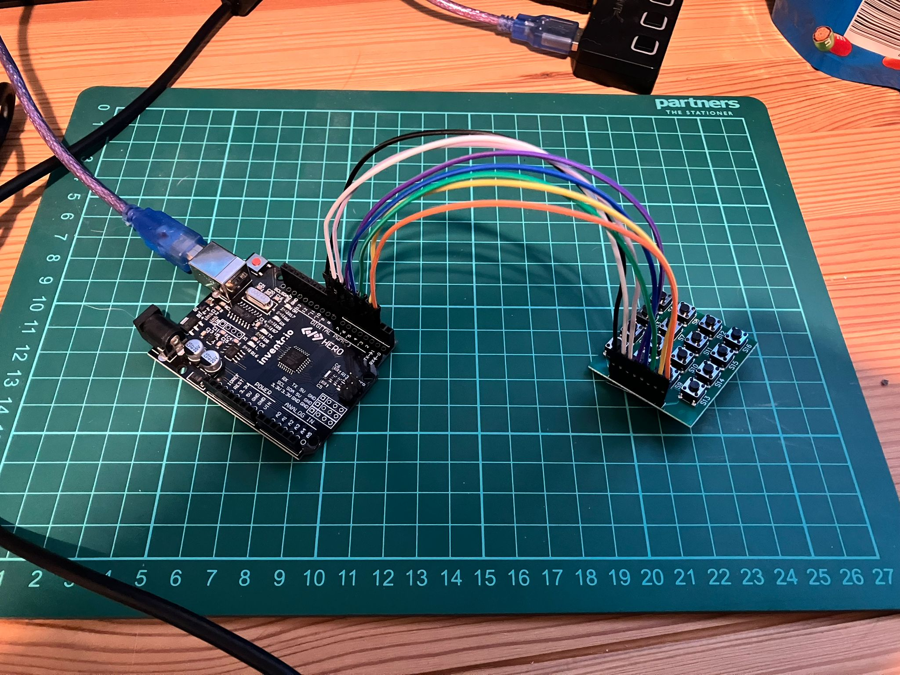

<!-- # Day 11 - 30 Days Lost in Space - Inventr -->

## 🏫 Lesson 11

- Day 11: Starting your control panel

  - [Original](https://inventr.io/lessons/day-11/)
  - [Remake](https://inventr.io/lessons/day-11-2/)

Today I got to use a new device, the keypad, which meant a new library was needed [Keypad](https://github.com/Chris--A/Keypad) from [Chris--A](https://github.com/Chris--A/).




Clicking each button from S1 to S16 outputs the following to the Serial Monitor.

```bash
17:49:58.714 -> 3
17:49:59.197 -> A
17:50:00.024 -> 4
17:50:00.539 -> 5
17:50:01.087 -> 6
17:50:02.942 -> B
17:50:03.881 -> 7
17:50:04.424 -> 8
17:50:04.842 -> 9
17:50:05.264 -> C
17:50:05.860 -> *
17:50:06.424 -> 0
17:50:06.878 -> #
17:50:07.458 -> D
```

### Parts

- Hero Board
- Type B USB Cable
- 8 cables (M-F)
- Keypad

## 👩🏻‍💻 Code

- https://github.com/inventrdotio/30DaysLostInSpace/tree/main/Day11-Starting_Your_Control_Panel

### Libraries

- https://github.com/Chris--A/Keypad
- https://www.arduinolibraries.info/libraries/keypad

## 📼 Videos

N/A

## 🔗 Links

- https://inventr.io/
- https://inventr.io/product/adventure-kit-30-days-lost-in-space/
- https://inventr.io/courses/adventurekit30dayslostinspace/

## Other Lessons

<?# Markdown ?>
<?!^ "./../includes/posts/inventr-ak1.md" /?>
<?#/ Markdown ?>
