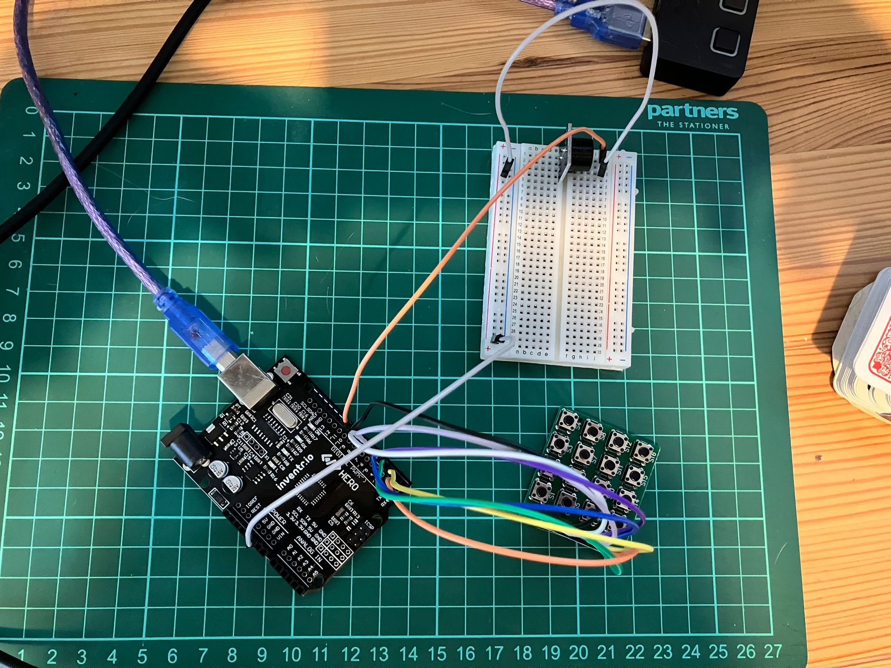
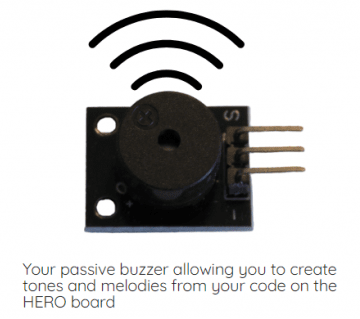

<!-- # Day 12 - 30 Days Lost in Space - Inventr -->

## 🏫 Lesson 12

- Day 12: Can you hear us?

  - [Original](https://inventr.io/lessons/day-12/)
  - [Remake](https://inventr.io/lessons/day-12-2/)

Today was an extension of [Day 11](inventr-ak1-day11), I got to use a new device, the passive buzzer, let's make some noise.





We are still using the keypad:


Clicking each button from S1 to S16 outputs the following to the Serial Monitor, with differing tones 🎶, "the tones Kevin".

```bash
11:19:51.087 -> Key: 1   Freq: 31
11:19:51.925 -> Key: 2   Freq: 93
11:19:52.837 -> Key: 3   Freq: 147
11:19:53.650 -> Key: A   Freq: 208
11:19:54.419 -> Key: 4   Freq: 247
11:19:55.158 -> Key: 5   Freq: 311
11:19:55.790 -> Key: 6   Freq: 370
11:19:56.482 -> Key: B   Freq: 440
11:19:57.208 -> Key: 7   Freq: 523
11:19:57.884 -> Key: 8   Freq: 587
11:19:58.540 -> Key: 9   Freq: 698
11:19:59.307 -> Key: C   Freq: 880
11:20:00.045 -> Key: *   Freq: 1397
11:20:00.738 -> Key: 0   Freq: 2637
11:20:01.480 -> Key: #   Freq: 3729
11:20:02.205 -> Key: D   Freq: 4978
```

### Parts

- Hero Board
- Type B USB Cable
- 8 cables (M-F)
- 8 cables (M-M)
- Keypad
- Passive Buzzer

## 👩🏻‍💻 Code

- https://github.com/inventrdotio/30DaysLostInSpace/tree/main/Day12-Can_You_Hear_Us
- https://github.com/robsoncouto/arduino-songs

### Libraries

- https://github.com/Chris--A/Keypad
- https://www.arduinolibraries.info/libraries/keypad

## 📼 Videos

<?# YouTube _rdKZPZRF_w /?>

<!-- <iframe width="560" height="315" src="https://www.youtube.com/embed/_rdKZPZRF_w" title="30 Days Lost in Space - Day 12" frameborder="0" allow="accelerometer; autoplay; clipboard-write; encrypted-media; gyroscope; picture-in-picture; web-share" allowfullscreen></iframe> -->

**Side Quest**

<?# YouTube nHFPzxAgY3Y /?>

<!-- <iframe width="560" height="315" src="https://www.youtube.com/embed/nHFPzxAgY3Y" title="30 Days Lost in Space - Day 12 - Side Quest" frameborder="0" allow="accelerometer; autoplay; clipboard-write; encrypted-media; gyroscope; picture-in-picture; web-share" allowfullscreen></iframe> -->

## 🔗 Links

- https://inventr.io/
- https://inventr.io/product/adventure-kit-30-days-lost-in-space/
- https://inventr.io/courses/adventurekit30dayslostinspace/

## Other Lessons

<?# Markdown ?>
<?!^ "./../includes/posts/inventr-ak1.md" /?>
<?#/ Markdown ?>
