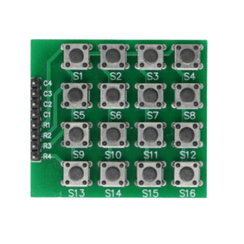

<!-- # Day 13 - 30 Days Lost in Space - Inventr -->

## 🏫 Lesson 13

- Day 13: HERO Security 101

  - [Original](https://inventr.io/lessons/day-13/)
  - [Remake](https://inventr.io/lessons/day-13-2/)

Today was a continuation of [Day 11](inventr-ak1-day11) and [Day 12](inventr-ak1-day12) but more coding and logic, using the same wiring and setup. This time we need to type in a password to get access to the system. We can also change the password.

<!--  -->



Trying out the different options.

```bash
11:33:10.390 -> Press * to set a new password.
11:33:10.432 -> Press # to access the system with the existing one.
11:33:22.330 -> Unlock Mode: Type Password to continue
11:33:28.558 -> WRONG PASSWORD
11:33:28.558 -> 1
11:33:28.558 -> Password error. Access Denied.
11:33:33.847 -> Unlock Mode: Type Password to continue
11:33:37.950 -> ****
11:33:40.255 -> Device Successfully Unlocked!
11:33:40.301 -> Welcome, authorized user. You may now begin using the system.
11:33:55.889 -> Unlock Mode: Type Password to continue
11:34:08.394 -> WRONG PASSWORD
11:34:08.394 -> 1
11:34:08.394 -> Access Denied. Cannot change password without knowing the previous or default.
```

### Parts

- Hero Board
- Type B USB Cable
- 8 cables (M-F)
- 8 cables (M-M)
- Keypad
- ~~Passive Buzzer~~

## 👩🏻‍💻 Code

- https://github.com/inventrdotio/30DaysLostInSpace/tree/main/Day13-HERO_Security_101

### Libraries

- https://github.com/Chris--A/Keypad
- https://www.arduinolibraries.info/libraries/keypad

## 📼 Videos

N/A

## 🔗 Links

- https://inventr.io/
- https://inventr.io/product/adventure-kit-30-days-lost-in-space/
- https://inventr.io/courses/adventurekit30dayslostinspace/

## Other Lessons

<?# Markdown ?>
<?!^ "./../includes/posts/inventr-ak1.md" /?>
<?#/ Markdown ?>
