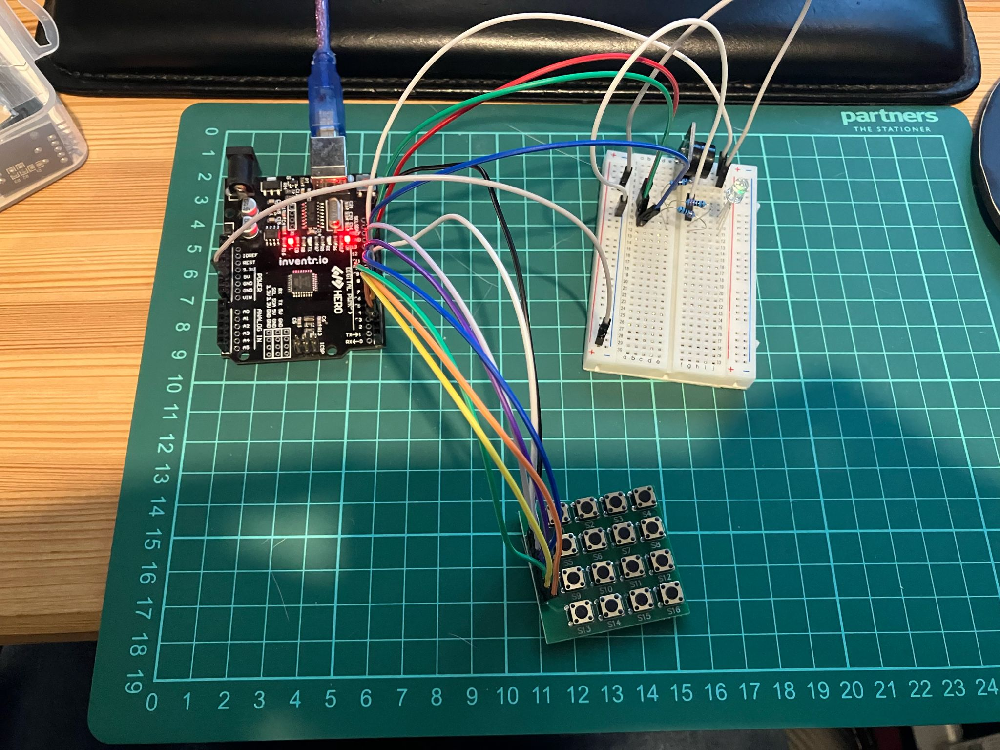

<!-- # Day 14 - 30 Days Lost in Space - Inventr -->

## 🏫 Lesson 14

- Day 14: Advanced security panel

  - [Original](https://learn.inventr.io/lessons/day-14/)
  - [Remake](https://learn.inventr.io/lessons/day-14-2/)

Today was an amalgamation of [Day 11](inventr-ak1-day11), [Day 12](inventr-ak1-day12) and [Day 13](inventr-ak1-day13) so we can combine _sound_, _light_ and the _keypad_.

PWM ~ is key on the board.

### Parts

- Hero Board
- Type B USB Cable
- Breadboard
- 16 cables (M-M)
- Keypad
- Passive Buzzer
- 3 220 Ω (Ohm) resistor
- 3 colour LED or RGB LED

## 👩🏻‍💻 Code

- https://github.com/inventrdotio/30DaysLostInSpace/tree/main/Day14-Advanced_Security_Panel

### Libraries

- https://github.com/Chris--A/Keypad
- https://www.arduinolibraries.info/libraries/keypad

## 📼 Videos

N/A

## 🔗 Links

- https://inventr.io/
- https://inventr.io/product/adventure-kit-30-days-lost-in-space/
- https://inventr.io/courses/adventurekit30dayslostinspace/

## Other Lessons

<?# Markdown ?>
<?!^ "./../includes/posts/inventr-ak1.md" /?>
<?#/ Markdown ?>
