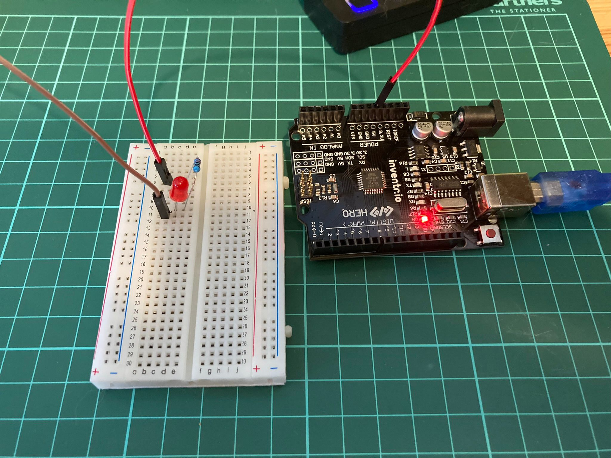

<!-- # Day 2 - 30 Days Lost in Space - Inventr -->

<?# Markdown ?>
<?!^ "./../includes/posts/inventr-ak1.md" /?>
<?#/ Markdown ?>

## Lesson 2

- Day 2: It’s really dark in here…

  - [Original](https://inventr.io/lessons/day-2-re-edit/)
  - [Remake](https://inventr.io/lessons/day-2-re-edit-2/)

In Day 2 I got to try another LED bulb, this time I needed a resistor and some wires with a breadboard.

### Parts

- Hero Board
- Type B USB Cable
- Breadboard
- 220 Ω (Ohm) resistor
- 2 cables
- 1 LED light (red)

## Code

- https://github.com/inventrdotio/30DaysLostInSpace/tree/main/Day02-It's_Really_Dark_In_Here

## Videos

<iframe width="560" height="315" src="https://www.youtube.com/embed/_sV5GV1UAig" title="30 Days Lost in Space - Day 1" frameborder="0" allow="accelerometer; autoplay; clipboard-write; encrypted-media; gyroscope; picture-in-picture; web-share" allowfullscreen></iframe>
<iframe width="560" height="315" src="https://www.youtube.com/embed/WzsfBSyXzjs" title="30 Days Lost in Space - Day 1" frameborder="0" allow="accelerometer; autoplay; clipboard-write; encrypted-media; gyroscope; picture-in-picture; web-share" allowfullscreen></iframe>

## Links

- https://inventr.io/
- https://inventr.io/product/adventure-kit-30-days-lost-in-space/
- https://inventr.io/courses/adventurekit30dayslostinspace/
