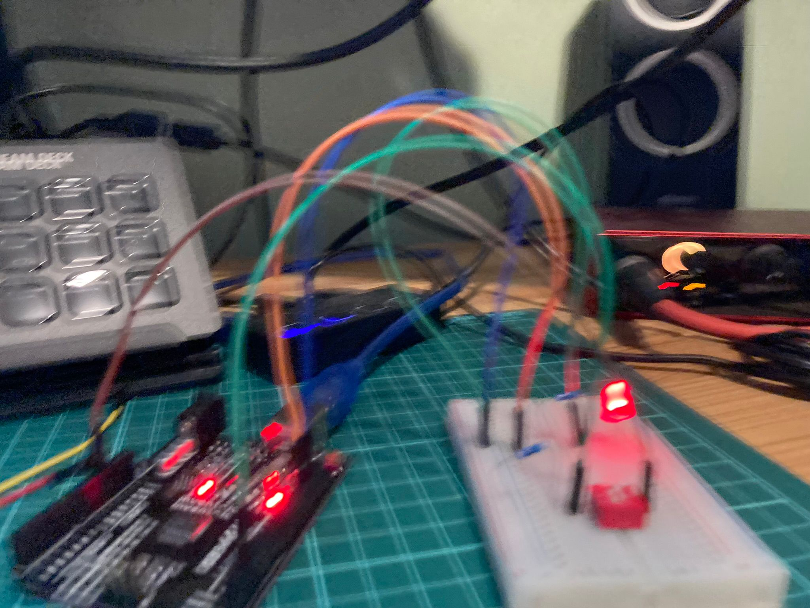

<!-- # Day 3 - 30 Days Lost in Space - Inventr -->

<?# Markdown ?>
<?!^ "./../includes/posts/inventr-ak1.md" /?>
<?#/ Markdown ?>

## Lesson 3

- Day 3: I’m worried about your battery levels

  - [Original](https://inventr.io/lessons/day-3/)
  - [Remake](https://inventr.io/lessons/day-3-2/)

Day 3 built upon [Day 2](inventr-ak1-day2) but this time with a fiddly switch.

### Parts

- Hero Board
- Type B USB Cable
- Breadboard
- 220 Ω (Ohm) resistor
- 10K Ω (Ohm) resistor
- 5 cables
- 1 LED light (red)
- DIP (Dual Inline Packet) switch

## Code

- https://github.com/inventrdotio/30DaysLostInSpace/tree/main/Day03-I'm_Worried_About_Your_Battery_Levels

## Videos

<iframe width="560" height="315" src="https://www.youtube.com/embed/0rHcTubUt8A" title="30 Days Lost in Space - Day 1" frameborder="0" allow="accelerometer; autoplay; clipboard-write; encrypted-media; gyroscope; picture-in-picture; web-share" allowfullscreen></iframe>

## Links

- https://inventr.io/
- https://inventr.io/product/adventure-kit-30-days-lost-in-space/
- https://inventr.io/courses/adventurekit30dayslostinspace/
