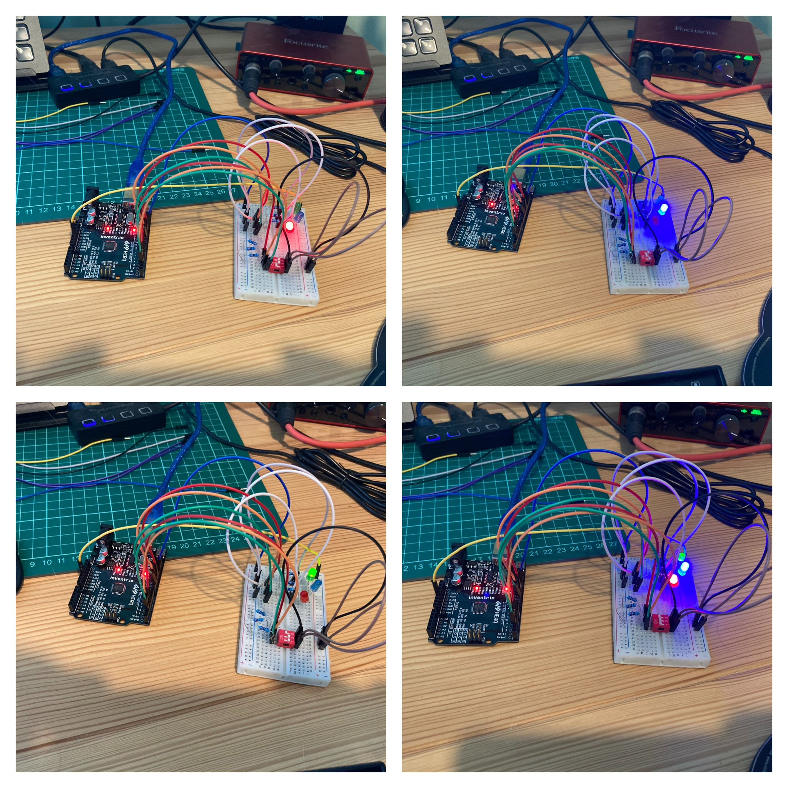

<!-- # Day 4 - 30 Days Lost in Space - Inventr -->

<?# Markdown ?>
<?!^ "./../includes/posts/inventr-ak1.md" /?>
<?#/ Markdown ?>

## Lesson 4

- Day 4: I’m worried about your battery levels

  - [Original](https://inventr.io/lessons/day-4/)
  - [Remake](https://inventr.io/lessons/day-4-2/)

Day 4 built upon [Day 3](inventr-ak1-day3) but with 2 new coloured LED bulbs.

### Parts

- Hero Board
- Type B USB Cable
- Breadboard
- 3 220 Ω (Ohm) resistors
- 3 10K Ω (Ohm) resistors
- 14 cables
- 3 LED lights (red/green/blue)
- DIP (Dual Inline Packet) switch

## Code

- https://github.com/inventrdotio/30DaysLostInSpace/tree/main/Day04-Cabin_Lighting

## Videos

N/A

<!-- <iframe width="560" height="315" src="https://www.youtube.com/embed/" title="30 Days Lost in Space - Day 4" frameborder="0" allow="accelerometer; autoplay; clipboard-write; encrypted-media; gyroscope; picture-in-picture; web-share" allowfullscreen></iframe> -->

## Links

- https://inventr.io/
- https://inventr.io/product/adventure-kit-30-days-lost-in-space/
- https://inventr.io/courses/adventurekit30dayslostinspace/
