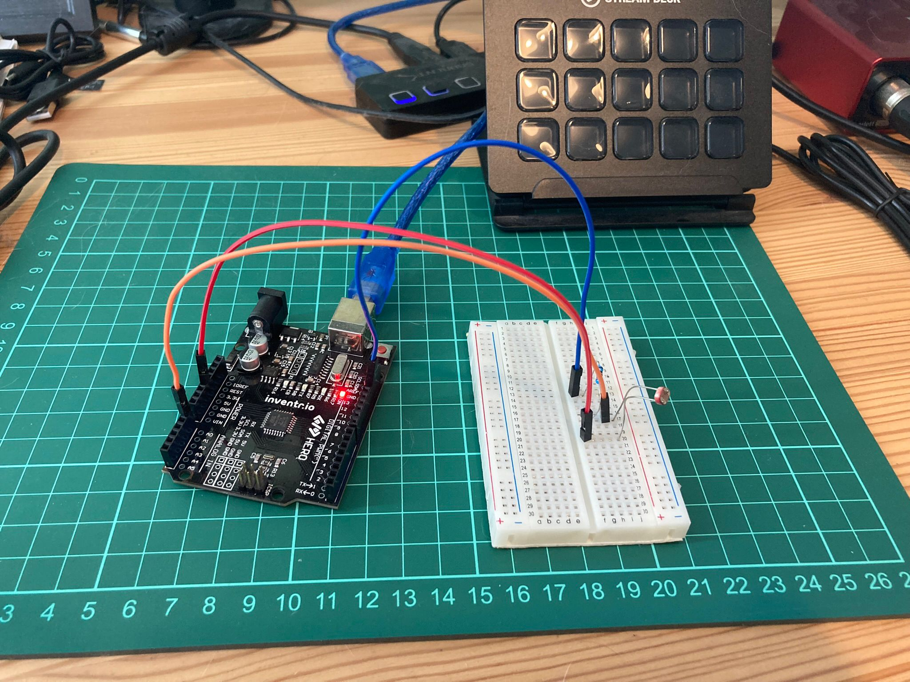

<!-- # Day 6 - 30 Days Lost in Space - Inventr -->

<?# Markdown ?>
<?!^ "./../includes/posts/inventr-ak1.md" /?>
<?#/ Markdown ?>

## Lesson 6

- Day 6: Time to fix the battery

  - [Original](https://inventr.io/lessons/day-6/)
  - [Remake](https://inventr.io/lessons/day-6-2/)

Day 6 used a new part, the Photoresistor, so had to play about with the lighting in the room.

### Parts

- Hero Board
- Type B USB Cable
- Breadboard
- 220 Ω (Ohm) resistor
- 3 cables
- Photoresistor

## Code

- https://github.com/inventrdotio/30DaysLostInSpace/tree/main/Day06-Time_To_Fix_The_Battery

## Videos

N/A

<!-- <iframe width="560" height="315" src="https://www.youtube.com/embed/" title="30 Days Lost in Space - Day 4" frameborder="0" allow="accelerometer; autoplay; clipboard-write; encrypted-media; gyroscope; picture-in-picture; web-share" allowfullscreen></iframe> -->

## Links

- https://inventr.io/
- https://inventr.io/product/adventure-kit-30-days-lost-in-space/
- https://inventr.io/courses/adventurekit30dayslostinspace/
