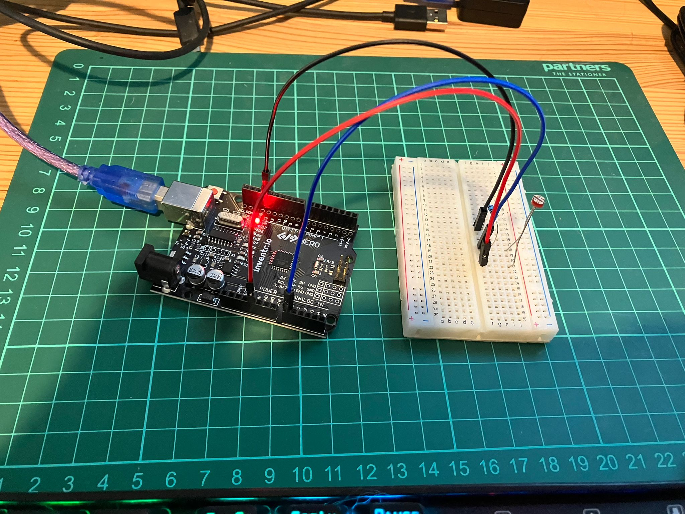

<!-- # Day 7 - 30 Days Lost in Space - Inventr -->

<?# Markdown ?>
<?!^ "./../includes/posts/inventr-ak1.md" /?>
<?#/ Markdown ?>

## Lesson 7

- Day 7: We still need to keep an eye on this

  - [Original](https://inventr.io/lessons/day-7/)
  - [Remake](https://inventr.io/lessons/day-7-2/)

Day 7 built upon [Day 6](inventr-ak1-day6) and checks the battery level.

Shining a light on the Photoresistor or covering it changed the speed at which the % increased in the logs.

```bash
10:56:48.834 -> 200 ms    charge at 0.17%
...
10:58:16.851 -> 14364 ms    charge at 99.34%
10:58:16.945 -> 14464 ms     FULLY CHARGED
```



### Parts

- Hero Board
- Type B USB Cable
- Breadboard
- 220 Ω (Ohm) resistor
- 3 cables
- Photoresistor

## Code

- https://github.com/inventrdotio/30DaysLostInSpace/tree/main/Day07-We_Still_Need_To_Keep_An_Eye_On_This

## Videos

N/A

<!-- <iframe width="560" height="315" src="https://www.youtube.com/embed/" title="30 Days Lost in Space - Day 4" frameborder="0" allow="accelerometer; autoplay; clipboard-write; encrypted-media; gyroscope; picture-in-picture; web-share" allowfullscreen></iframe> -->

## Links

- https://inventr.io/
- https://inventr.io/product/adventure-kit-30-days-lost-in-space/
- https://inventr.io/courses/adventurekit30dayslostinspace/
