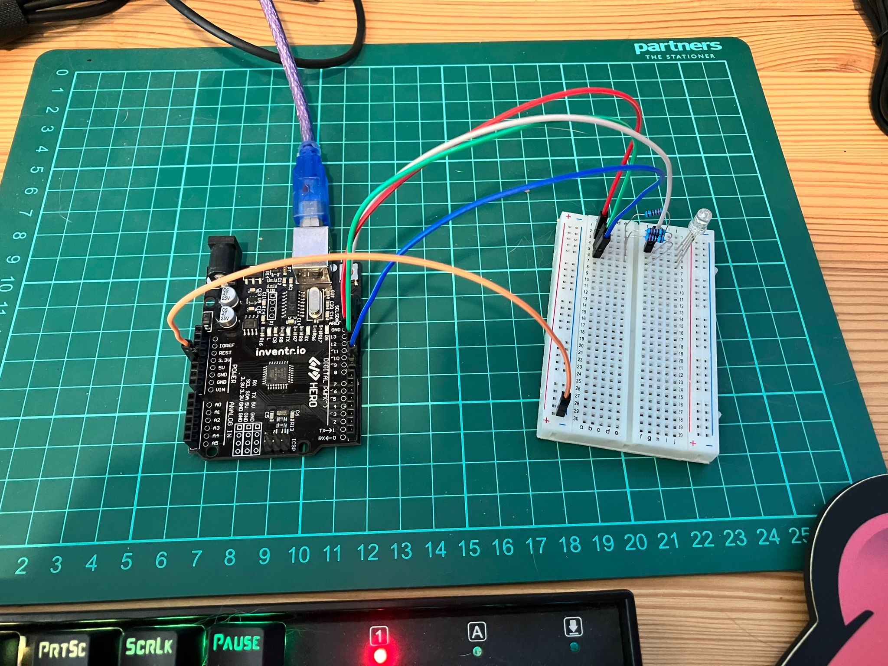
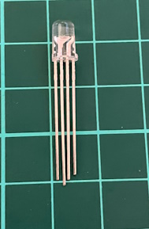

<!-- # Day 8 - 30 Days Lost in Space - Inventr -->

<?# Markdown ?>
<?!^ "./../includes/posts/inventr-ak1.md" /?>
<?#/ Markdown ?>

## Lesson 8

- Day 8: Adding some color to this dark place

  - [Original](https://inventr.io/lessons/day-8/)
  - [Remake](https://inventr.io/lessons/day-8-2/)

Back to LEDs today but this time it's an RGB LED. 🔴🟢🔵. Using some Pulse-width modulation (PWM) this time round. Who doesn't love a bit of a colour change, and very festive for this time of year.

### Parts

- Hero Board
- Type B USB Cable
- Breadboard
- 3 220 Ω (Ohm) resistor
- 5 cables
- 3 colour LED or RGB LED

## Code

- https://github.com/inventrdotio/30DaysLostInSpace/tree/main/Day08-Adding_Some_Color_To_This_Dark_Place

## Videos

<?# YouTube yh15KHNu74o /?>

<?# YouTube hN5Sr7tciqQ /?>

<!-- <iframe width="560" height="315" src="https://www.youtube.com/embed/" title="30 Days Lost in Space - Day " frameborder="0" allow="accelerometer; autoplay; clipboard-write; encrypted-media; gyroscope; picture-in-picture; web-share" allowfullscreen></iframe> -->

## Links

- https://inventr.io/
- https://inventr.io/product/adventure-kit-30-days-lost-in-space/
- https://inventr.io/courses/adventurekit30dayslostinspace/
