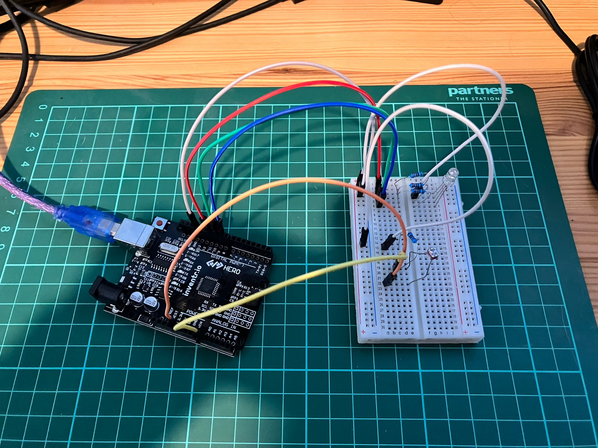

<!-- # Day 9 - 30 Days Lost in Space - Inventr -->

<?# Markdown ?>
<?!^ "./../includes/posts/inventr-ak1.md" /?>
<?#/ Markdown ?>

## 🏫 Lesson 9

- Day 9: A better way to do things

  - [Original](https://inventr.io/lessons/day-9/)
  - [Remake](https://inventr.io/lessons/day-9-2/)

Day 9 built upon [Day 8](inventr-ak1-day8) and we joined a few days together, cleaned up some code, added some comments, this now completes the battery charging utility!

### Parts

- Hero Board
- Type B USB Cable
- Breadboard
- 4 220 Ω (Ohm) resistor
- 8 cables
- 3 colour LED or RGB LED
- Photoresistor

## 👩🏻‍💻 Code

- https://github.com/inventrdotio/30DaysLostInSpace/tree/main/Day09-A_Better_Way_To_Do_Things

## 📼 Videos

<?# YouTube 09j5iKF_EBw /?>

<!-- <iframe width="560" height="315" src="https://www.youtube.com/embed/09j5iKF_EBw" title="30 Days Lost in Space - Day " frameborder="0" allow="accelerometer; autoplay; clipboard-write; encrypted-media; gyroscope; picture-in-picture; web-share" allowfullscreen></iframe> -->

## 🔗 Links

- https://inventr.io/
- https://inventr.io/product/adventure-kit-30-days-lost-in-space/
- https://inventr.io/courses/adventurekit30dayslostinspace/
