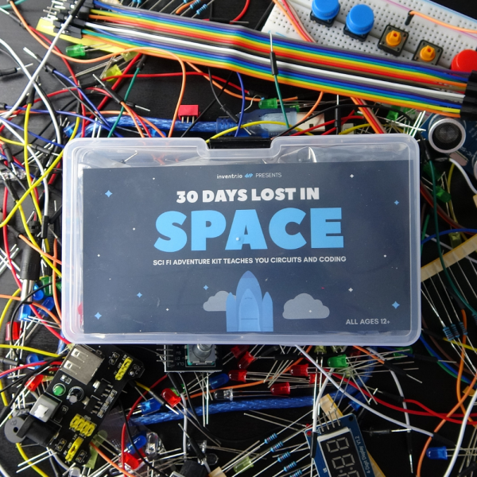

<!-- # 30 Days Lost in Space - Inventr -->

<?# Markdown ?>
<?!^ "./../includes/posts/inventr-ak1.md" /?>
<?#/ Markdown ?>

Having worked with some arduino stuff after watching Frank's streams on Twitch (see [Build Light](/buildlight)), I'd been talking to a mate who said he'd bought the following for his son. What better way to get a good broad understand of a number of items but to get a whole kit trying out various pieces of hardware.

Look out for more posts for each Day I work on...

## Videos

<iframe width="560" height="315" src="https://www.youtube.com/embed/_sV5GV1UAig?si=-H1kkZ92SMSqkCS_" title="YouTube video player" frameborder="0" allow="accelerometer; autoplay; clipboard-write; encrypted-media; gyroscope; picture-in-picture; web-share" allowfullscreen></iframe>

<?# YouTube _sV5GV1UAig /?>

## Your Challenge

We’re sorry to say it, but you seem to be stuck 100 feet underwater on some alien planet. No worries though, we’ve dealt with this situation thousands of times.

We know this may sound overwhelming, but you need to learn to code and wire so you can fix your destroyed control panel.

While you’re at it, we detected a few other “minor ” repairs you will need to complete. Your solar panel is offline, the air ballast system has failed, your security systems aren’t working, and the worst problem of all, your entertainment system is down.

Again, nothing to stress out over, it’s all fixable with the right tools and training. This repair kit has an excellent success rate and will walk you step by step through each repair mission.

It will take you exactly thirty days to repair your shuttle and we will guide you through all the steps necessary, from coding to wiring up your fancy new hardware setup.

Starting with those dang lights, it’s kind of hard to fix complex systems if you can’t see them. Then we will work all the way to getting your shuttle out of the water and off this backward planet!

30 Lessons. 30 Missions. 30 Days.

## Cost

|                                      |         |        |
| ------------------------------------ | ------- | ------ |
| Adventure Kit: 30 Days Lost in Space | $97.00  |        |
| Discount                             | -$38.80 |        |
| Shipping                             | $18.88  |        |
| **Total**                            | $77.08  | £63.15 |

## Links

- https://inventr.io/
- https://inventr.io/product/adventure-kit-30-days-lost-in-space/
- https://inventr.io/courses/adventurekit30dayslostinspace/
- https://github.com/inventrdotio
- https://github.com/inventrdotio/30DaysLostInSpace

- https://fritzing.org/
