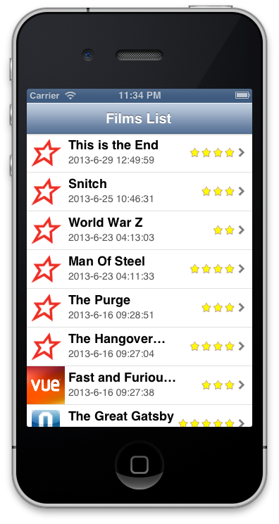

So I've been working on it a little more tonight,

I've added the Star Ratings now.

Copied

return \[UIImage imageNamed:@"1StarSmall.png"\];

for each one, changed all the numbers from 1 to 2 to 3 etc but forget to change Star to Star**s**, couldn't work out why it wasn't working, the String comparison was working, checked other things, nothing seemed to be fixing it, of course don't have any 1 Star Ratings or it would have shown up, or if I'd copied a line other than the first to return another image.

Oh well, lets learn and move on.

[Original Link](https://alexhedley.wordpress.com/2013/06/29/ios-film-app-cont/)
