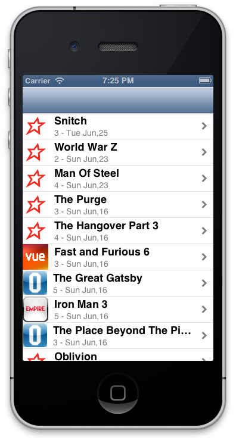

So I'm slowing converting an App from the Treehouse tutorial

http://teamtreehouse.com/library/ios-development/build-a-blog-reader-iphone-app

I'm pulling my Films Blog instead.

http://alexhedley.com/films/

Just changing the pic depending on the Cinema I went to, gotta work on the Stars next, think I might use the idea from http://www.raywenderlich.com/1797/how-to-create-a-simple-iphone-app-tutorial-part-1 for showing the stars.

 [Original Link](https://alexhedley.wordpress.com/2013/06/28/ios-app-film-blog/)
