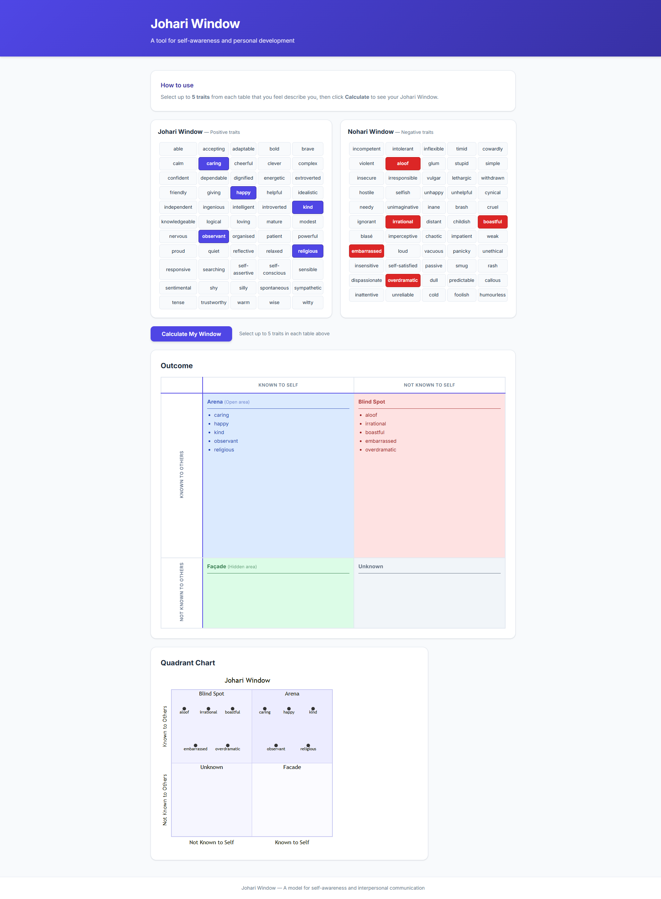

<!-- # Johari / Nohari Window -->

During a workshop I was asked to use create a Johari Window, so of course I wanted to build an app for it. I started this back in May 2023 and it's sat on the back burner for a few years.

> The Johari window is a technique designed to help people better understand their relationship with themselves and others. It was created by psychologists Joseph Luft (1916–2014) and Harrington Ingham (1916–1995) in 1955, and is used primarily in self-help groups and corporate settings as a heuristic exercise. Luft and Ingham named their model "Johari" using a combination of their first names.

> A model for self-awareness and interpersonal communication

Producing the graph I thought I could lean into my favourite diagraming tool [MermaidJS](https://mermaid.ai/) and used a [Quadrant Chart](https://mermaid.ai/open-source/syntax/quadrantChart.html).

I build a list of the items and made them clickable but never got round to using those to calculate the result, taking that as a starting point and using my [GitHub Copilot](github-copilot) trial I got to it:

## Site

- 🌍 https://alex-hedley.github.io/johari-window/

## </> Code

- https://github.com/alex-hedley/johari-window

## 🔗Links

- https://github.com/alex-hedley/johari-window/issues/2
  - https://github.com/alex-hedley/johari-window/pull/3
  - https://github.com/alex-hedley/johari-window/tasks/5e462668-d146-4e3c-8347-bd3c52a394a6?author=AlexHedley
- https://github.com/alex-hedley/johari-window/issues/1
  - https://github.com/alex-hedley/johari-window/pull/4
  - https://github.com/alex-hedley/johari-window/tasks/b5972e31-4002-4561-b651-806af4c0a6e8?author=AlexHedley
- https://github.com/alex-hedley/johari-window/pull/9
  - https://github.com/alex-hedley/johari-window/tasks/f1324688-c830-4cb4-b9d7-e759264f8b41?author=AlexHedley

- https://en.wikipedia.org/wiki/Johari_window
- https://kevan.org/johari
- https://kevan.org/nohari